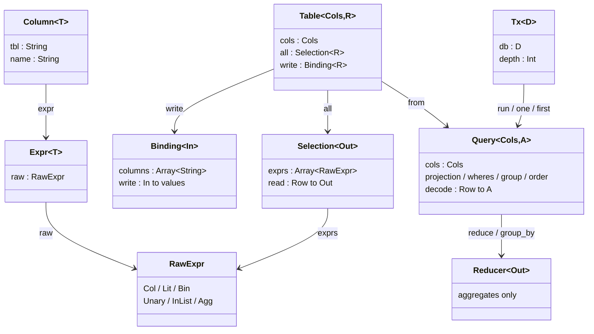

# cairn

A thin, type-safe SQL toolkit for MoonBit.

**English** | [日本語](README_ja.md)

Write one row type. A generator turns it into column handles, a projection, a
decoder and an encoder; you build typed queries and DML on top of those and run
them against any `Driver`. **The row type and the domain entity are treated as
separate things**, and the mapping between them is yours to write. The query
pipeline follows [Acadia](https://acadia.engineering/).

```moonbit
@sql.from(User::table())
|> @sql.Query::filter(u => u.age.gte(18) & u.deleted_at.is_none())
|> @sql.Query::map(u => @sql.sel(u.name))
|> @sql.Query::order_by(u => [u.name.asc()])
|> @sql.Query::limit(20)
```

```sql
SELECT u."name"
  FROM "users" AS u
 WHERE u."age" >= ? AND u."deleted_at" IS NULL
 ORDER BY u."name" ASC
 LIMIT ?
-- parameters: [18, 20]
```

Against a `users` table holding alice (30), bob (17), carol (42) and a
soft-deleted dave (25), that returns `["alice", "carol"]` — an `Array[String]`,
because the `map` narrowed the projection to one column. Every chapter below
works the same way: a table, a pipeline, the SQL it emits, and the rows that
come back.

## What it is

- **A query builder, not an ORM.** No identity map, no lazy loading, no change
  tracking. A query is a value; running it is a separate step.
- **Typed at the column.** `Column[T]` carries a phantom `T`, so a
  `Column[Int]` will not accept a string and a `Column[String]` cannot be
  summed.
- **Database-agnostic.** cairn produces SQL text plus an ordered parameter
  list. Anything that can run that pair is a driver; SQLite, PostgreSQL and a
  recording fake ship in `src/driver`.
- **Generated, not reflected.** The generator emits ordinary MoonBit source you
  can read and diff. Nothing is discovered at runtime.

## Install

```bash
moon add Allianaab2m/cairn
```

```moonbit
// moon.pkg
import {
  "Allianaab2m/cairn/sql",
  "Allianaab2m/cairn/driver/sqlite",
}
```

The whole dependency graph builds on the `native` target only: both SQL client
libraries are native FFI, and so is `moonbitlang/async` beneath them.

## Quickstart

**1. Declare the row type.** The annotated struct is the flat shape of one row.

```moonbit
#cairn.table(name="users", alias="u")
pub(all) struct User {
  #cairn.id
  id : Int
  name : String
  age : Int
  deleted_at : String?
} derive(Debug, Eq)
```

**2. Generate.**

```bash
moon run src/gen/cmd -- src/app/entities.mbt -o src/app/entities.g.mbt
```

You get `UserCols`, `User::cols()`, `User::all()`, `User::binding()`,
`User::table()`, `User::table_of()` and `User::primary_key_name()`.

**3. Query, and run it.**

```moonbit
async fn main {
  @sqlite.with_connection("app.db", driver => {
    let db = @sql.Tx::new(driver)
    let adults = (@sql.from(User::table())
      |> @sql.Query::filter(u => u.age.gte(18))).run(db)
    println(adults.length())
  })
}
```

## The vocabulary

A handful of types carry everything. The rest of the API is combinators over them.



| Type | Means | Chapter |
|---|---|---|
| `Table[Cols, R]` | a table, plus how to read and write one row of it | [Table](docs/01-table.md) |
| `Selection[Out]` | which columns to read, and how to decode them | [Table](docs/01-table.md) |
| `Binding[In]` | which columns to write, and how to encode them | [Table](docs/01-table.md) |
| `Column[T]` / `Expr[T]` | a typed column reference / a typed expression | [Query](docs/02-query.md) |
| `Query[Cols, A]` | a SELECT under construction, yielding `A` | [Query](docs/02-query.md) |
| `Insert` / `Update[Cols]` / `Delete[Cols]` | a write under construction | [DML](docs/03-dml.md) |
| `Nullable[C, R]` | the right-hand side of an outer join | [JOIN](docs/04-join.md) |
| `Reducer[Out]` | a summary over many rows — aggregates only | [Aggregation](docs/05-aggregate.md) |
| `Executor` / `Driver` / `Tx[D]` | run a statement / bracket a transaction | [Execution](docs/06-execution.md) |

The `T` in `Expr[T]` and `Column[T]` is a phantom: it never reaches the SQL and
exists only to keep comparisons honest.

## Documentation

| | |
|---|---|
| [1. Table](docs/01-table.md) | defining tables, codegen, and the row-vs-domain seam |
| [2. Query](docs/02-query.md) | `Query` and the expression language |
| [3. DML](docs/03-dml.md) | `Insert`, `Update`, `Delete` |
| [4. JOIN](docs/04-join.md) | inner and outer joins, and naming the joined shape |
| [5. Aggregation](docs/05-aggregate.md) | `Reducer`, `reduce`, `group_by` |
| [6. Execution](docs/06-execution.md) | `Executor`, `Driver`, `Tx`, transactions, drivers |
| [7. Repository](docs/07-repository.md) | the pattern cairn is designed to sit under |
| [8. Design notes](docs/08-design.md) | why the types are shaped this way, and what is missing |

## Package layout

```
src/sql/            core library — expressions, projection, query, DML, emission
src/gen/            code generator — attributes to IR to output
src/gen/cmd/        the CLI (cairn-gen)
src/driver/sqlite/  SQLite driver
src/driver/postgres/PostgreSQL driver
src/driver/fake/    recording fake, for testing repositories
src/example/        two worked entities: a plain one and a row-vs-domain one
```

## Development

```bash
moon check      # type check
moon test       # tests
moon fmt        # format
moon info       # refresh .mbti
```

The code blocks in this repository's Markdown are not type-checked: checking
them would mean keeping each file as `.mbt.md` inside a package under `src/`,
and files outside the module's `source = "src"` are not covered.

## License

Apache-2.0
