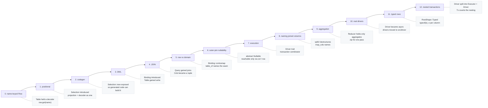
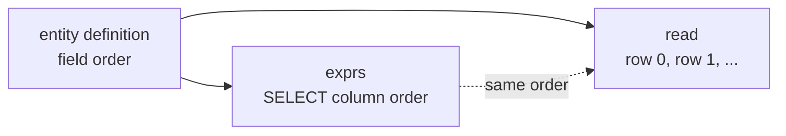
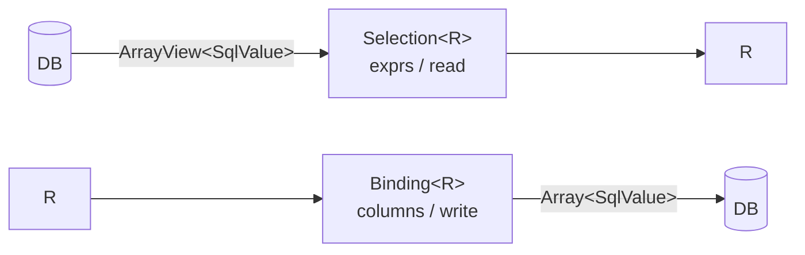
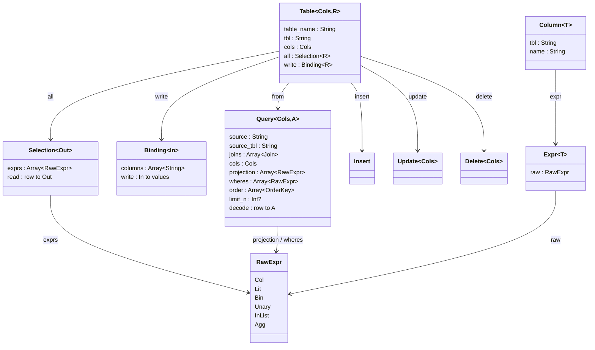
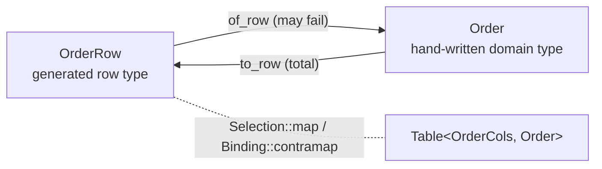
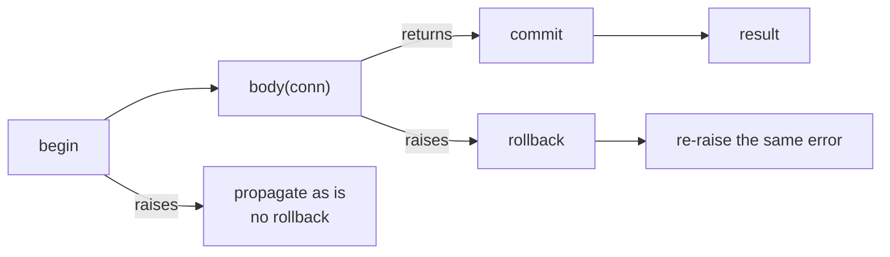
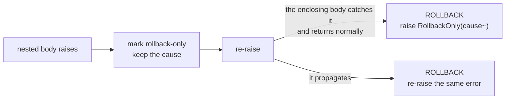

# cairn

A thin, type-safe SQL toolkit for MoonBit.

**English** | [日本語](README_ja.md)

Write one row type and you get column handles, a projection, a decoder and an
encoder generated for you, then build typed queries and DML on top. **The row
type and the domain entity are treated as separate things**, and the mapping
between them is yours to write. The query pipeline follows
[Acadia](https://acadia.engineering/).

Execution is delegated to whatever implements the `Driver` trait, so cairn
itself depends on no particular database. The drivers that do implement it live
in `src/driver`, one package each, so the query builder never sees a binding.

## How the types got here



What changed in `Table` and `Query` at each step.

| Step | Change | Why |
|---|---|---|
| 0 | `Table { cols, decoder }`, `Row` a map from column name to value | first sketch |
| 1 | `Row = ArrayView[SqlValue]`, `Selection[Out]` carries projection and decoder, `Table { .., all }` | projection order and decode order can no longer disagree |
| 2 | `Selection::new` made public | `Selection` is a `pub struct`, so the package holding generated code could not build one |
| 3 | `Binding[In]` added, `Table { .., write }` | INSERT needs the value-to-row direction |
| 4 | `Query { .., joins }`, `Query::join` makes `Cols` a tuple | more than one table |
| 5 | `Binding::contramap` added, generator emits `table_of`, attribute became `#cairn.table` | the row type and the domain type are different things, and the mapping is written by hand |
| 6 | `left_join` returns the abstract `Nullable[C, R]`, `Selection::optional` added | make outer-join nullability enforced by the type |
| 7 | `Driver` trait and `transaction`, `run` / `one` / `first` on every statement | build the SQL *and* run it |
| 8 | `split2` and `Query::map_cols` added | stand in for the lambda destructuring MoonBit lacks |
| 9 | `Reducer[Out]` with `Query::reduce` / `group_by` | make an invalid aggregate query unwritable |
| 10 | `Driver` and `run` / `one` / `first` / `transaction` became `async`, drivers moved to `src/driver` | the PostgreSQL client for MoonBit is async, and a synchronous trait cannot hold it |
| 11 | `RowShape` on `Driver`, `columns~` on `query` | the SQLite binding reports neither a result column's type nor its nullness, and guessing would be a silent wrong answer |
| 12 | `Driver` split into `Executor` + `Driver : Executor`, `Tx[D]` added, `transaction` takes a `Tx` | two repositories that each bracket their own work must not send `BEGIN` twice, and a transaction body has no business committing |

### 1. Why `Selection`

`Selection[Out]` binds "which columns to read" (`exprs`) and "how to turn a row
into a value" (`read`) into one value. Kept apart, they break the usual way:
a column gets added to the projection and the decoder is not updated.



`read` reads **by position**. That is fragile by hand, but the generator emits
`exprs` and `read` from one pass over the same field list, so in practice they
cannot drift.

### 3. Reading and writing are mirrors

`Binding[In]` is the reflection of `Selection[Out]`.



Both come from the same field list, so a SELECT and an INSERT cannot disagree
about what each column position means.

## The types today



`Cols` is generated per entity (`UserCols` and friends): a struct of
`Column[T]` fields. The `T` in `Expr[T]` and `Column[T]` is a phantom type that
never reaches the SQL. It exists only to keep comparisons honest — you cannot
hand a string to a `Column[Int]`.

The comparison operators live directly on `Column[T]`, so you write
`u.age.gte(18)`. The two types are not merged because `Column` also carries a
name, which `sel`, `Binding` and `Update::set` need, while a general expression
has no name to give. `Column::expr()` remains as the way out when you are
assembling an expression directly, such as an aggregate.

## Using it

cairn treats **the row type and the domain entity as separate things**. What is
generated is the plumbing around the row type; the correspondence between the
two is written by the programmer.

### 1. Write the row type

```moonbit
#cairn.table(name="users", alias="u")
pub(all) struct User {
  #cairn.id
  id : Int
  name : String
  age : Int
  deleted_at : String?
} derive(Debug, Eq)
```

The annotated struct is **the flat shape of one row**. It has to be `pub(all)`:
callers build values to hand to `insert`, and a plain `pub` struct is read-only
to them.

`cols="..."` overrides the name of the column-handle struct (the default is
`<TypeName>Cols`).

### 2. Generate

```
moon run src/gen/cmd -- src/example/entities.mbt -o src/example/entities.g.mbt
```

You get `UserCols`, `User::cols()`, `User::all()`, `User::binding()`,
`User::table()`, `User::table_of()` and `User::primary_key_name()`. The output
is ordinary MoonBit source, so you can read it and diff it.

Downstream, a `pre-build` hook in `moon.pkg` calls a prebuilt `cairn-gen`.
**A hook that runs `moon run` inside the same module recurses forever**, so the
examples in this repository are generated explicitly.

### 3. When the row type and the domain entity do not line up

If the domain models its state transitions as a sum type, it will not be 1-1
with the table. The row has to leave `submitted_at` and `tracking` nullable,
while the domain type can make each state's fields unconditional.

```moonbit
#cairn.table(name="orders", alias="o", cols="OrderCols")
pub(all) struct OrderRow {
  #cairn.id
  id : Int
  items : Int
  status : String
  submitted_at : String?
  tracking : String?
}

pub(all) enum Order {
  Draft(id~ : Int, items~ : Int)
  Submitted(id~ : Int, items~ : Int, submitted_at~ : String)
  Shipped(id~ : Int, items~ : Int, submitted_at~ : String, tracking~ : String)
}
```

The mapping is written by hand. This is the only place the domain knowledge
actually lives.

```moonbit
pub fn Order::of_row(r : OrderRow) -> Order raise @sql.DecodeError {
  match (r.status, r.submitted_at, r.tracking) {
    ("draft", _, _) => Draft(id=r.id, items=r.items)
    ("submitted", Some(at), _) => Submitted(id=r.id, items=r.items, submitted_at=at)
    ("shipped", Some(at), Some(t)) =>
      Shipped(id=r.id, items=r.items, submitted_at=at, tracking=t)
    _ => raise @sql.Malformed("orders id=\{r.id}: illegal stored state")
  }
}

pub fn Order::to_row(self : Order) -> OrderRow { ... }
```

Then build a **table typed by the domain entity**.

```moonbit
pub fn orders() -> @sql.Table[OrderCols, Order] {
  OrderRow::table_of(Order::of_row, Order::to_row)
}
```

From there queries and DML both speak `Order`; `OrderRow` never crosses the
boundary. Only the reading direction may `raise`, deliberately: **the table can
hold combinations the domain type rejects**. The writing direction is total.



When the row type and the domain type do agree, skip this step and use the
generated `User::table()` directly.

### 4. Queries

```moonbit
@sql.from(User::table())
|> @sql.Query::filter(u => u.age.gte(18) & u.deleted_at.is_none())
|> @sql.Query::map(u => @sql.sel(u.name))
|> @sql.Query::order_by(u => [u.name.asc()])
|> @sql.Query::limit(20)
```

```sql
SELECT u."name"
  FROM "users" AS u
 WHERE u."age" >= ? AND u."deleted_at" IS NULL
 ORDER BY u."name" ASC
 LIMIT ?
```

Filters are written against **the row's columns**, because that is what the
database has. What comes back is governed by the domain type.

### 5. DML

```moonbit
@sql.insert(User::table(), user)
@sql.insert_except(User::table(), user, omit=["id"])  // let the database assign the key
@sql.update(User::table(), u => u.id.eq(7))
|> @sql.Update::set(u => u.name, "bob")
@sql.delete(User::table(), u => u.age.lt(18))
```

```sql
INSERT INTO "users" ("id", "name", "age", "deleted_at")
 VALUES (?, ?, ?, ?)

UPDATE "users" AS u
    SET "name" = ?
  WHERE u."id" = ?

DELETE FROM "users" AS u
  WHERE u."age" < ?
```

`update` and `delete` take the predicate as a **required argument**. As a step
in a chain it could be forgotten, and forgetting it rewrites the whole table;
to target every row you call `update_all` or `delete_all` and say so by name.

### 6. JOIN

```moonbit
@sql.from(User::table())
|> @sql.Query::join(Post::table(), (u, p) => u.id.eq_col(p.author_id))
|> @sql.Query::filter(c => c.0.age.gte(18) & c.1.title.ne("draft"))
|> @sql.Query::map(c => @sql.sel2(c.0.name, c.1.title))
|> @sql.Query::order_by(c => [c.1.id.desc()])
```

```sql
SELECT u."name", p."title"
  FROM "users" AS u
  JOIN "posts" AS p ON u."id" = p."author_id"
 WHERE u."age" >= ? AND p."title" <> ?
 ORDER BY p."id" DESC
```

`join` takes `Query[C1, A]` and `Table[C2, R2]` to `Query[(C1, C2), A]`. `Cols`
becomes a tuple, so from then on `.0` and `.1` reach each table's columns.

Acadia's joins produce tuples too (`intersect : … -> Rows (a, b)`). The
difference is that Elm can destructure them in a lambda parameter,
`\((a, b), c) -> …`, and **MoonBit has no such syntax**. cairn fills the gap
with two tools.

**Two tables: `split2`.** It turns a function of N named arguments into the
one-argument function the combinators expect, so the `.0` lives inside cairn
and never in your code.

```moonbit
|> @sql.Query::filter(@sql.split2((u, p) => u.age.gte(18) & p.title.ne("draft")))
|> @sql.Query::map(@sql.split2((_u, p) => @sql.sel(p.title)))
```

**Three or more: name the shape with `map_cols`.** Once the arguments start
needing positional `_` placeholders, naming reads better than destructuring.

```moonbit
|> @sql.Query::map_cols(c => { ticket: c.0.0, assignment: c.0.1, closure: c.1 })
|> @sql.Query::filter(j => j.ticket.id.eq(id))
```

If a struct feels like too much, a `typealias` at least makes the signature
readable.

```moonbit
pub typealias ((UserCols, PostCols), TagCols) as UserPostTag
```

Assembling one domain value out of several tables uses the same tools: write
the domain type into the `Selection[D]` that `Query::map(c => ...)` returns.

#### LEFT JOIN

The right-hand side of an outer join comes back as `Nullable[C2, R2]`, an
**abstract type with no exposed representation**. There is no route to a
`Column[T]` inside it. Exactly two ways in:

```moonbit
c.1.col(p => p.title)   // Column[String?]  -- when you want a column
c.1.row()               // Selection[Post?] -- when you want the row
```

`row()` is usually closer to what an outer join means. It is not saying that
each column might independently be NULL; it is saying **the row on the right
either exists or does not**, and inside `Some` every field keeps the type the
table declared.

```moonbit
@sql.from(User::table())
|> @sql.Query::left_join(Post::table(), (u, p) => u.id.eq_col(p.author_id))
|> @sql.Query::map(c => @sql.sel(c.0.name).zip(c.1.row()))
```

```
matched   -> ("alice", Some({ id: 7, title: "hello" }))
unmatched -> ("bob", None)
```

"No match" is detected as "every column on the right is NULL". That is always
right for a projection containing a column the database never leaves NULL, and
`Table::all` always includes one. For a hand-built projection of entirely
nullable columns, name the deciding column with `Selection::optional_on(key~)`.

## Execution

### Executor and Driver

All cairn asks of a real database is that it can run a statement plus an
ordered parameter list. That is `Executor`, and it is all a statement needs:

```moonbit
pub(open) trait Executor {
  async query(Self, String, Array[SqlValue], columns~ : Int) -> Array[Array[SqlValue]] raise DbError
  async execute(Self, String, Array[SqlValue]) -> Int raise DbError
  dialect(Self) -> Dialect
  row_shape(Self) -> RowShape = _   // defaults to Plain
}
```

Bracketing a transaction is a separate capability, and a driver is an
`Executor` that also has it:

```moonbit
pub(open) trait Driver : Executor {
  async begin(Self) -> Unit raise DbError
  async commit(Self) -> Unit raise DbError
  async rollback(Self) -> Unit raise DbError
}
```

**The split is the point.** `run` / `one` / `first` are bounded by `Executor`,
and everything cairn hands to the body of a transaction is an `Executor` and
nothing more — so code running inside a transaction cannot commit or roll back
the transaction it is running inside. Only `Tx` sends those three statements.

The driver is the connection. Pooling, if you want it, belongs outside.

**Why `async`.** Of the two SQL client libraries MoonBit has, one is
synchronous and the other is not, and MoonBit has no polymorphism over
asyncness — an `async` function can only be called from an `async` function. A
synchronous trait could not hold the asynchronous client at all, while an
asynchronous one holds both: a synchronous driver implements an `async` method
with an ordinary `fn`, since a body that never suspends is a valid body. So the
trait is `async` and `run` / `one` / `first` / `transaction` are too, which
means calling them needs an `async fn main` or an `async test`.

`async` itself compiles on every backend, so the query builder stays portable;
it is the two client libraries, and `moonbitlang/async` under them, that are
native-only.

### Drivers

| Package | Backing library | Target |
|---|---|---|
| `@fake` (`src/driver/fake`) | none — records statements and replays canned rows | native |
| `@postgres` (`src/driver/postgres`) | [`moonbit-community/postgres`](https://github.com/moonbit-community/postgres.mbt) | native |
| `@sqlite` (`src/driver/sqlite`) | [`moonbit-community/sqlite3`](https://github.com/moonbit-community/sqlite3.mbt) | native |

```moonbit
@postgres.with_connection(
  @postgres.config(host="localhost", user="alliana", database="cairn"),
  db => {
    let tickets = @sql.from(TicketRow::table()).run(db)
    ...
  },
)
```

`with_connection` exists because the client splits a connection into a `Client`
that statements go through and a `Connection` whose `run` drives the protocol
underneath it. Nothing happens unless something drives that pump, so it is
spawned for you and the connection is closed however the body ends.

The two translations either side of the wire are the whole of the driver.
Going out, the *server* decides what type each placeholder has, so cairn's
`VInt(Int64)` is encoded at whatever width the column turned out to be. Coming
back, the row description names each column's type, so a `SqlValue` of the
matching shape can be built — cairn's decoders match on the constructor, and a
guess would be a silent wrong answer. PostgreSQL types cairn has no shape for
(dates, timestamps, uuid) are refused by name rather than guessed at; cast them
in the query, as in `submitted_at::text`.

```moonbit
@sqlite.with_connection(":memory:", db => {
  let tickets = @sql.from(TicketRow::table()).run(db)
  ...
})
```

### Why `RowShape`

The SQLite binding is deliberately thin: it hands back whatever you ask a
column for, and has no public way to report a column's type or to say `NULL`.
Ask it for a column as an `Int` and a NULL arrives as `0` — a real value, and
the wrong one. That is a silent wrong answer in the middle of an otherwise
type-safe path, so the type is asked of the database rather than guessed.

A driver declares which shape of SELECT list it needs, and cairn writes it:

```sql
-- RowShape::Plain, what a driver that can describe a result row needs
SELECT i."id", t."tag" FROM "items" AS i LEFT JOIN "tags" AS t ON ...

-- RowShape::Typed, what the SQLite driver declares
SELECT typeof(i."id"), i."id", typeof(t."tag"), t."tag" FROM ...
```

The driver folds each pair back into one `SqlValue`, so nothing above it sees
the doubled list — which is also why `query` is told `columns~`, the width of
the projection rather than of the SELECT list. Each projected expression is
rendered **once** and its text reused, since rendering it twice would bind any
literal in it twice and shift every later placeholder.

The tag SQLite returns is the value's storage class, not the column's declared
type, so a column declared `INTEGER` that holds text reads back as text — which
is what is actually stored.

Going the other way, a `VNull` parameter is simply not bound. SQLite reads an
unbound parameter as NULL, and that is the only way to send one through this
binding.

Both gaps are one small change away in the binding itself — `internal/ffi`
already has `sqlite3_column_type` and `sqlite3_bind_null`, they are just not
public — so this may become unnecessary upstream.

Testing a repository does not need any of this: `@fake.FakeDb` implements the
same trait, and records what it was asked to run.

```moonbit
let db = @fake.FakeDb::new(counts=[1, 1])
let repo = SqlTickets::new(db)
repo.save(Open(id=1, subject="printer on fire"))
db.log  // ["BEGIN", "QUERY", "EXEC", "COMMIT"]
```

### Running

```moonbit
query.run(db)     // Array[A]  -- every row
query.one(db)     // A         -- exactly one; NotFound at zero, TooManyRows above one
query.first(db)   // A?        -- the first row, if any
insert.run(db)    // Int       -- rows affected
update.run(db)    // Int
delete.run(db)    // Int
```

Over a table typed by a domain entity, what comes back is domain values. The
row type does not appear.

```moonbit
@sql.from(orders()).run(db)
// => [Shipped(id=1, items=3, submitted_at="2026-08-01", tracking="ZZ123"),
//     Draft(id=2, items=1)]
```

### Transactions

**There is no transaction monad.** MoonBit's error effect does that job, so the
body is an ordinary function that may `raise` part way through.

```moonbit
let db = @sql.Tx::new(driver)

@sql.transaction(db, conn => {
  let removed = @sql.delete(DraftRow::table(), d => d.id.eq(2)).run(conn)
  let added = @sql.insert(SubmittedRow::table(), { id: 2, items: 1, submitted_at: at }).run(conn)
  (removed, added)
})
```

begin / commit / rollback are wrapped in a combinator rather than exposed
individually, so that a `raise` in the middle of the body cannot leave a
transaction open.



- The body returning means COMMIT; the body raising means ROLLBACK and then
  **re-raising the same error**
- A rollback that itself fails **does not swallow the original error**, since
  the cause is the more useful of the two
- If `begin` fails there is nothing to undo, so no ROLLBACK is sent

All three are pinned by tests (`["BEGIN", "EXEC", "EXEC", "COMMIT"]`,
`["BEGIN", "EXEC", "ROLLBACK"]`, `[]`).

#### Why a `Tx` rather than the driver

`transaction` takes a `Tx[D]`, not the driver. A `Tx` is the driver plus one
number — how deep into nested transactions this connection currently is — and
that is what lets **calls nest**:

```moonbit
pub struct Tx[D] {
  db : D
  mut depth : Int        // 0 means nothing is open; the next scope must BEGIN
  mut failure : Error?   // what a nested scope failed with, if one did
}
```

Only the outermost scope sends `BEGIN` and `COMMIT`. An inner one runs its body
and nothing else, so two operations that each insist on being atomic land in
one transaction when something wraps them:

```moonbit
@sql.transaction(db, _ => {
  tickets.save(a)   // save brackets its own work...
  users.save(b)     // ...but here both join the enclosing transaction
})
// => ["BEGIN", "QUERY", "EXEC", "QUERY", "EXEC", "COMMIT"]
```

Run on its own, that same `save` *is* the outermost scope and brackets itself.
A repository never has to know which case it is in — which is the reason
nothing about a transaction is passed as an argument.

**An inner scope cannot fail by itself.** There is no savepoint underneath
this, so there is no way to undo only one scope's writes. A nested failure
therefore marks the whole transaction rollback-only, and if the body catches it
and carries on, the outermost scope refuses to commit:



Committing instead would write whichever half of the work happened to survive.
`RollbackOnly` carries the failure that made the commit impossible, not the
fact that someone swallowed it. The poison is scoped to the transaction, not to
the connection: the next one starts clean.

A `Tx` counts one connection's position in one call stack, so it is not safe to
share between concurrently running tasks.

## Aggregation

`Reducer[Out]` folds many rows into one summary. Its runtime shape is the same
as `Selection`, but the type is **deliberately separate**: a `Reducer` may only
hold aggregate expressions, so projecting a bare ungrouped column alongside an
aggregate — which SQL rejects — **cannot be written in the first place**.

```moonbit
count()                        // Reducer[Int]     -- row count; 0 over no rows
count_of(c)                    // Reducer[Int]     -- rows where the column is not NULL
min(c) / max(c) / sum(c)       // Reducer[T?]      -- None over no rows
avg(c)                         // Reducer[Double?]
```

`min` and friends read as `T?` while `count` reads as `Int`, matching SQL:
`COUNT(*)` over no rows is zero, whereas `MIN` is NULL.

`sum` and `avg` require `SqlNum`; `min` and `max` require `SqlOrd`. Both are
marker traits, there only to keep a `Column[String]` from being summed.

### Several summaries in one pass

```moonbit
@sql.from(users())
|> @sql.Query::filter(u => u.deleted_at.is_none())
|> @sql.Query::reduce(u => @sql.count().zip(@sql.min(u.age)).zip(@sql.max(u.age)))
```

```sql
SELECT COUNT(*), MIN(u."age"), MAX(u."age")
  FROM "users" AS u
 WHERE u."deleted_at" IS NULL
```

Acadia offers `map2` through `map9` here; `zip` plus `map` covers the same
ground without an arity ladder.

### Grouping

```moonbit
@sql.from(users())
|> @sql.Query::group_by(u => u.name, u => @sql.count().zip(@sql.avg(u.age)))
```

```sql
SELECT u."name", COUNT(*), AVG(u."age")
  FROM "users" AS u
 GROUP BY u."name"
```

The grouping key is the only non-aggregate the projection can contain, and it
is exactly the column being grouped by, so **the result is always a legal
aggregate query**. Rows come back as `(K, S)` pairs.

Run a single summary with `one`, a grouped one with `run`.

## The Repository pattern

cairn provides nothing for this. A repository is ordinary application code.

### The shape falls out of MoonBit's traits

A trait method cannot introduce type parameters of its own, so **a generic
`Repository[T, ID]` cannot be written**. What you get instead is an interface
per aggregate, in domain vocabulary — and `unassigned` says something a generic
`find_by(criteria)` cannot.

```moonbit
// Port: the domain's vocabulary. No dependency on cairn.
pub(open) trait TicketRepository {
  find(Self, Int) -> Ticket? raise
  save(Self, Ticket) -> Unit raise
  unassigned(Self) -> Array[Ticket] raise
}

// Adapter: generic over the driver, holding one as its connection.
struct SqlTickets[D] {
  db : D
}

pub impl[D : @sql.Driver] TicketRepository for SqlTickets[D] with find(self, id) {
  (ticket_query() |> @sql.Query::filter(c => c.0.0.id.eq(id))).first(self.db)
}
```

The `impl` needs `pub`. Without it, callers outside the package get
"no `impl` is defined".

### When the aggregate is spread over several tables

This is where a repository earns its keep. Take an aggregate split into phase
tables:

```
tickets(id, subject)
ticket_assignments(ticket_id -> tickets.id, assignee)
ticket_closures(ticket_id -> ticket_assignments.ticket_id, resolution)
```

`find` is a single statement with two outer joins.

```moonbit
pub struct TicketJoin {
  ticket : TicketCols
  assignment : @sql.Nullable[AssignmentCols, AssignmentRow]
  closure : @sql.Nullable[ClosureCols, ClosureRow]
}

@sql.from(TicketRow::table())
|> @sql.Query::left_join(AssignmentRow::table(), (t, a) => t.id.eq_col(a.ticket_id))
|> @sql.Query::left_join(ClosureRow::table(), (c, cl) => c.0.id.eq_col(cl.ticket_id))
|> @sql.Query::map_cols(c => { ticket: c.0.0, assignment: c.0.1, closure: c.1 })
|> @sql.Query::map(j => TicketRow::all(j.ticket)
  .zip(j.assignment.row())
  .zip(j.closure.row())
  .map(assemble))
```

The nesting is confined to the one `map_cols` line. Everything after reads
`j.assignment`, not `c.0.1`.

**Which phase rows came back is the state.** No discriminator column exists.

| Rows returned | Aggregate rebuilt |
|---|---|
| base only | `Open(id=1, subject="printer on fire")` |
| base + assignment | `Assigned(..., assignee="dana")` |
| all three | `Closed(..., resolution="unplugged it")` |

A domain-meaningful query is the absence of a phase row.

```moonbit
|> @sql.Query::filter(j => j.assignment.col(a => a.ticket_id).is_none())
// -> WHERE ta."ticket_id" IS NULL
```

### `save` is where the ungenerable work lives

Phase rows are immutable facts, so saving is additive: read what is there and
insert only what is missing.

```moonbit
@sql.transaction(self.db, conn => {
  let before = self.find(id)
  if before is None { /* insert the base row */ }
  if ticket.assignee() is Some(a) && recorded_assignee is None { /* insert assignment */ }
  if ticket.resolution() is Some(r) && recorded_resolution is None { /* insert closure */ }
})
```

| Operation | Statements issued |
|---|---|
| save a new `Open` | `INSERT INTO "tickets" ("id", "subject")` |
| `Open` to `Assigned` | `INSERT INTO "ticket_assignments" ("ticket_id", "assignee")` |
| failure part way | `["BEGIN", "QUERY", "EXEC", "ROLLBACK"]` |

The base row is not rewritten. This is **where the aggregate's shape meets the
tables'**, and it is the part a generator cannot write.

### How it meets transactions

A repository holds a `Tx[D]`, not a driver:

```moonbit
struct SqlTickets[D] {
  db : @sql.Tx[D]
}
```

which is why `save` can bracket its own work without knowing whether anything
else already has. Hand **the same `Tx`** to every repository over that
connection, once, at wiring time:

```moonbit
let db = @sql.Tx::new(@sqlite.Sqlite::open("app.db"))
let tickets = SqlTickets::new(db)
let users = SqlUsers::new(db)

@sql.transaction(db, _ => {
  tickets.save(a)
  users.save(b)
})   // one BEGIN, one COMMIT
```

The shared depth is the whole mechanism: give two repositories two different
`Tx` values over the same connection and they will ask the database to `BEGIN`
twice, which SQLite rejects outright. Nothing has to be rebuilt inside the
transaction — the repositories above are the same objects throughout.

## Where it errs on the safe side

| Situation | Behaviour |
|---|---|
| INSERT with no rows | raises `EmptyInsert` |
| UPDATE with no assignment | raises `EmptyUpdate` |
| column count not matching value count | raises `ArityMismatch` |
| joining on a repeated alias (self-join) | raises `DuplicateAlias` |
| UPDATE / DELETE without a predicate | you must call `update_all` / `delete_all` |
| `one` finding zero or several rows | raises `NotFound` / `TooManyRows` |
| a transaction body failing | ROLLBACK, then the same error is re-raised |
| a nested transaction failing and the enclosing body carrying on | ROLLBACK, then `RollbackOnly` carrying the original cause |

## Not built yet

- **Aliasing and self-joins** — the `Column`s inside `Cols` bake in the alias,
  so `Table` would need to hold `cols` as `(String) -> Cols`
- **A security type parameter** — `Table[Sec, Cols, R]`, matching Acadia's
  `Table Unrestricted Food`. The `#cairn.table(security=...)` slot is reserved
- **Indexes, constraints, migrations** — unknown attribute names are ignored on
  purpose, so adding these later will not break an older generator

## Development

```
moon check      # type check
moon test       # tests
moon fmt        # format
moon info       # refresh .mbti
```

Package layout:

```
src/sql/        core library (expressions, projection, query, DML, emission)
src/gen/        code generator (attributes -> IR -> output)
src/gen/cmd/    CLI (cairn-gen)
src/example/    worked examples of entities and generated output
```

The generator parses MoonBit source with
[`moonbitlang/parser`](https://mooncakes.io/docs/moonbitlang/parser).
Attributes are read from the raw text in `Attribute.raw`, because `parsed` is
not populated for user-defined namespaces and `name()` drops the namespace.

The code blocks in this README are not type-checked. Checking them would mean
keeping the file as `.mbt.md` inside a package under `src/`; files outside the
module's `source = "src"` are not covered.
