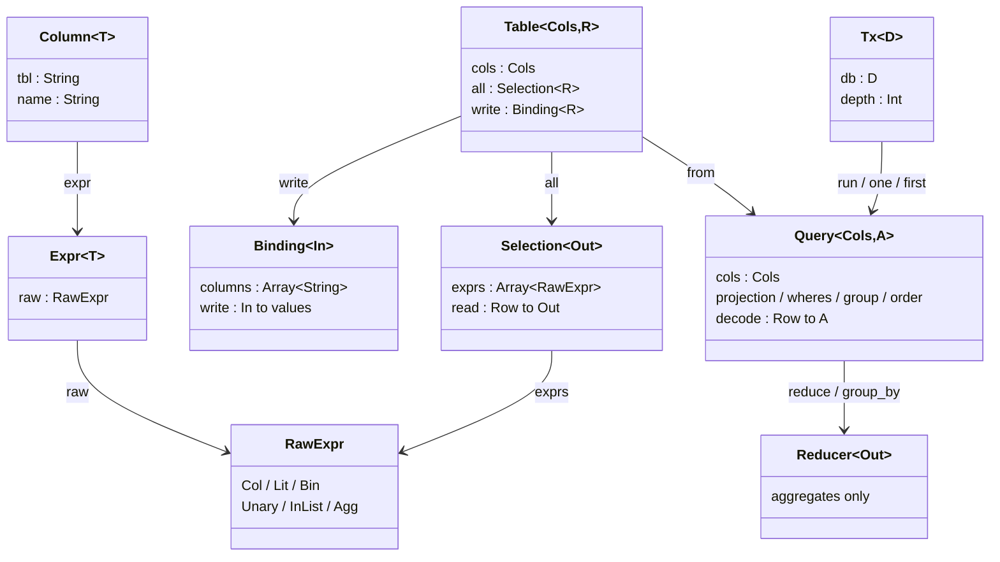

# aya

A thin, type-safe SQL toolkit for MoonBit.

[English](README.md) | **日本語**

行型を 1 つ書けば、カラムハンドル・射影・デコーダ・エンコーダが生成されます。
それらの上に型の付いたクエリと DML を組み立て、`Driver` を実装した任意の
バインディングで実行します。**行型とドメインエンティティは別物として扱い**、
両者の対応づけはプログラマが書きます。クエリパイプラインの設計は
[Acadia](https://acadia.engineering/) を参考にしています。

```moonbit
@sql.from(User::table())
|> @sql.Query::filter(u => u.age.gte(18) & u.deleted_at.is_none())
|> @sql.Query::map(u => @sql.sel(u.name))
|> @sql.Query::order_by(u => [u.name.asc()])
|> @sql.Query::limit(20)
```

```sql
SELECT u."name"
  FROM "users" AS u
 WHERE u."age" >= ? AND u."deleted_at" IS NULL
 ORDER BY u."name" ASC
 LIMIT ?
-- パラメータ: [18, 20]
```

alice (30)・bob (17)・carol (42)・論理削除済みの dave (25) を持つ `users`
テーブルに対しては `["alice", "carol"]` が返ります。`map` が射影を 1 列に
絞ったので `Array[String]` です。以降の各章も同じ形で進みます — テーブル、
パイプライン、生成される SQL、そして返ってくる行。

## 何であって、何でないか

- **クエリビルダであって ORM ではない。** アイデンティティマップも遅延ロードも
  変更追跡もありません。クエリは値であり、実行はそれとは別の一手です。
- **列の単位で型が付く。** `Column[T]` は幽霊型 `T` を持つので、`Column[Int]` に
  文字列は渡せず、`Column[String]` は合計できません。
- **データベースに依存しない。** aya が作るのは SQL 文字列と順序付きパラメータ列
  だけです。その組を実行できるものがドライバであり、SQLite・PostgreSQL・記録用の
  フェイクを `src/driver` に同梱しています。
- **リフレクションではなく生成。** ジェネレータが吐くのは読めて diff の取れる
  ふつうの MoonBit ソースです。実行時に何かを探索することはありません。
- **スキーマも同じ定義から。** `aya-kit` がエンティティと直前のスナップショットを
  比較してマイグレーションを書きます。データベースへの接続は要りません。

## 導入

```bash
moon add Allianaab2m/aya
```

```moonbit
// moon.pkg
import {
  "Allianaab2m/aya/sql",
  "Allianaab2m/aya/driver/sqlite",
}
```

依存グラフ全体がビルドできるターゲットは `native` だけです。2 つの SQL
クライアントライブラリはどちらもネイティブ FFI であり、その下にある
`moonbitlang/async` も同様だからです。

## クイックスタート

**1. 行型を書く。** 注釈を付けた構造体が「1 行の平坦な形」です。

```moonbit
#aya.table(name="users", alias="u")
pub(all) struct User {
  #aya.id
  id : Int
  name : String
  age : Int
  deleted_at : String?
} derive(Debug, Eq)
```

**2. 生成する。**

```bash
aya-kit codegen
```

`UserCols`, `User::cols()`, `User::all()`, `User::binding()`, `User::table()`,
`User::table_of()`, `User::primary_key_name()` が手に入ります。
同じ注釈からテーブルそのものも出せます。[スキーマとマイグレーション](docs/ja/08-schema.md)を参照してください。

**3. クエリを組み立てて実行する。**

```moonbit
async fn main {
  @sqlite.with_connection("app.db", driver => {
    let db = @sql.Tx::new(driver)
    let adults = (@sql.from(User::table())
      |> @sql.Query::filter(u => u.age.gte(18))).run(db)
    println(adults.length())
  })
}
```

## 語彙

ごく少数の型がすべてを担っています。残りの API はその上のコンビネータです。



| 型 | 意味 | 章 |
|---|---|---|
| `Table[Cols, R]` | テーブルと、その 1 行を読み書きする方法 | [Table](docs/ja/01-table.md) |
| `Selection[Out]` | どの列を読み、どうデコードするか | [Table](docs/ja/01-table.md) |
| `Binding[In]` | どの列に書き、どうエンコードするか | [Table](docs/ja/01-table.md) |
| `Column[T]` / `Expr[T]` | 型付きの列参照 / 型付きの式 | [Query](docs/ja/02-query.md) |
| `Query[Cols, A]` | 組み立て中の SELECT、結果は `A` | [Query](docs/ja/02-query.md) |
| `Insert` / `Update[Cols]` / `Delete[Cols]` | 組み立て中の書き込み | [DML](docs/ja/03-dml.md) |
| `Nullable[C, R]` | 外部結合の右辺 | [JOIN](docs/ja/04-join.md) |
| `Reducer[Out]` | 複数行の要約 — 集約関数のみ | [集約](docs/ja/05-aggregate.md) |
| `Executor` / `Driver` / `Tx[D]` | 文を実行する / トランザクションで括る | [実行](docs/ja/06-execution.md) |

`Expr[T]` と `Column[T]` の `T` は幽霊型です。SQL には一切現れず、比較の型を
守るためだけに存在します。

## ドキュメント

| | |
|---|---|
| [1. Table](docs/ja/01-table.md) | テーブル定義、コード生成、行型とドメイン型の継ぎ目 |
| [2. Query](docs/ja/02-query.md) | `Query` と式の言語 |
| [3. DML](docs/ja/03-dml.md) | `Insert` / `Update` / `Delete` |
| [4. JOIN](docs/ja/04-join.md) | 内部結合と外部結合、結合後の形に名前を付ける |
| [5. 集約](docs/ja/05-aggregate.md) | `Reducer` / `reduce` / `group_by` |
| [6. 実行](docs/ja/06-execution.md) | `Executor` / `Driver` / `Tx`、トランザクション、ドライバ |
| [7. Repository](docs/ja/07-repository.md) | aya が下敷きになることを想定したパターン |
| [8. スキーマとマイグレーション](docs/ja/08-schema.md) | 同じ注釈から DDL を出す `aya-kit` |
| [9. 設計ノート](docs/ja/09-design.md) | なぜこの型なのか、何が足りないのか |

## パッケージ構成

```
src/sql/            コアライブラリ — 式・射影・クエリ・DML・SQL 生成
src/gen/            エンティティ解析 — 属性から IR — とカラムハンドル生成
src/ddl/            IR からスナップショット・差分・DDL へ
src/kit/            設定とマイグレーション計画（すべて純粋）
src/kit/cmd/        CLI (aya-kit)
src/driver/sqlite/  SQLite ドライバ
src/driver/postgres/PostgreSQL ドライバ
src/driver/fake/    記録用フェイク。Repository のテスト向け
src/example/        例題エンティティ 2 つ。素直な例と、行型・ドメイン型が食い違う例
migrations/         src/example から生成したマイグレーション
```

## 開発

```bash
moon check      # 型検査
moon test       # テスト
moon fmt        # 整形
moon info       # .mbti 更新
```

このリポジトリの Markdown 内のコードブロックは型検査されていません。検査するには
各ファイルを `src/` 配下のパッケージ内に `.mbt.md` として置く必要があり、モジュールの
`source = "src"` の外にあるファイルは対象外だからです。

## ライセンス

Apache-2.0
