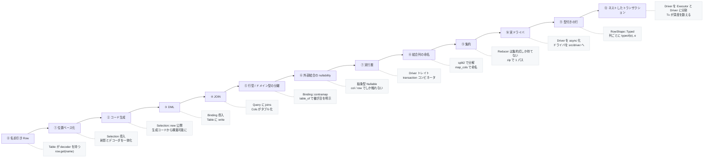
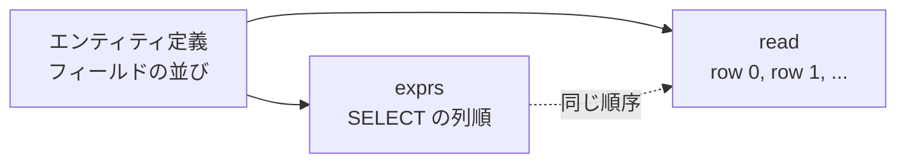
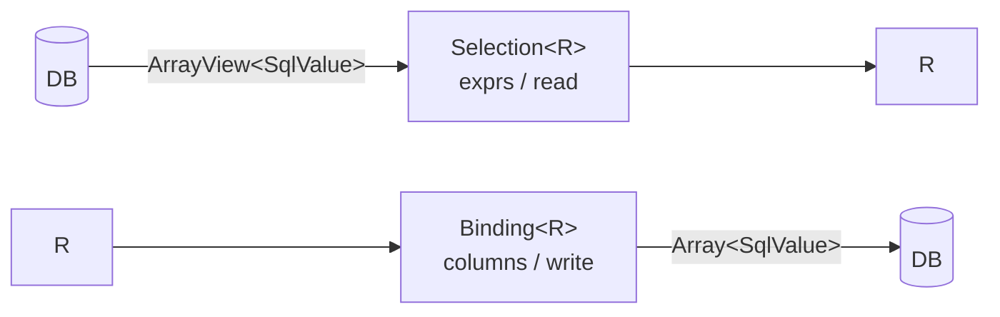
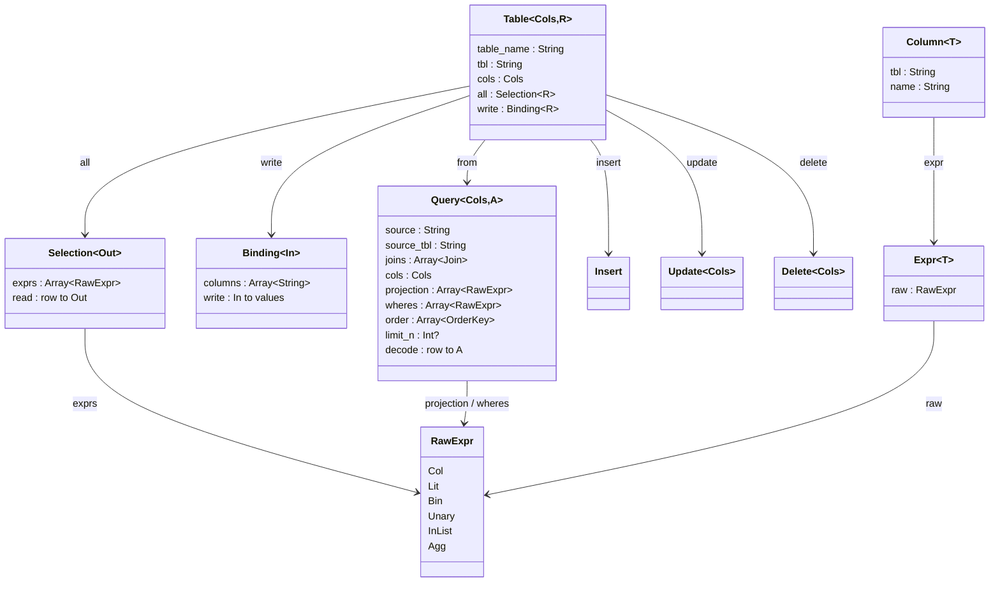
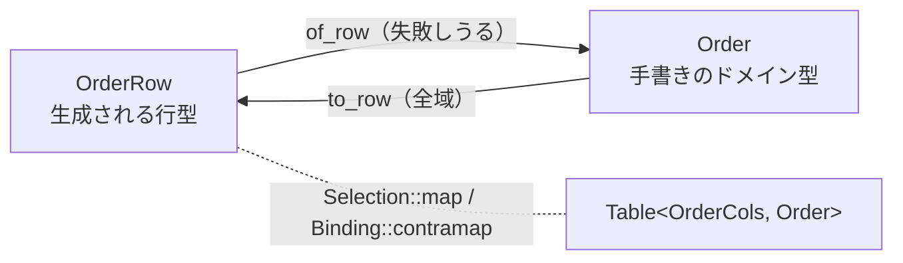
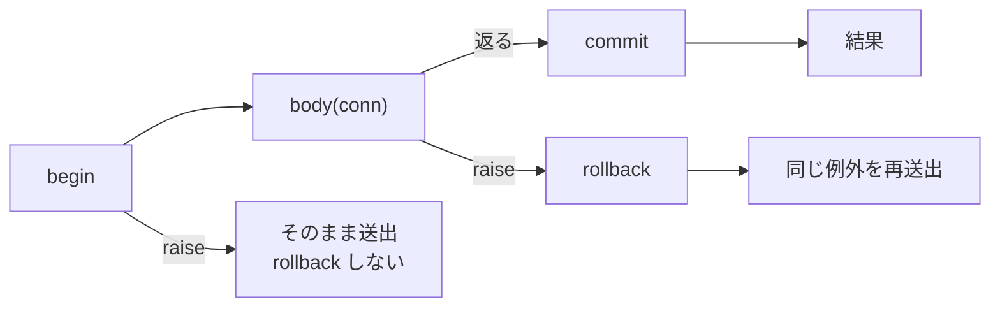
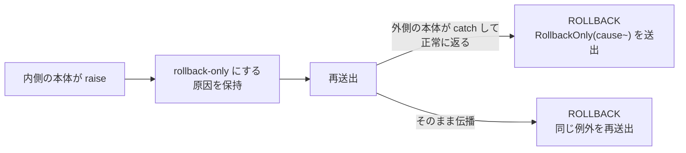

# cairn

A thin, type-safe SQL toolkit for MoonBit.

[English](README.md) | **日本語**

行型を 1 つ書けば、カラムハンドル・射影・デコーダ・エンコーダが生成され、型の付いた
クエリと DML を組み立てられます。**行型とドメインエンティティは別物として扱い**、
両者の対応づけはプログラマが書きます。クエリパイプラインの設計は
[Acadia](https://acadia.engineering/) を参考にしています。

実行は `Driver` トレイトを実装した任意のバインディングに委ねます。cairn 自体は
どのデータベースにも依存しません。実装側のドライバは `src/driver` 以下に
1 パッケージずつ置いてあり、クエリビルダがバインディングを見ることはありません。

## 型の変遷



各段階で `Table` と `Query` の形がどう変わったかです。

| 段階 | 変更 | 動機 |
|---|---|---|
| ⓪ | `Table { cols, decoder }`、`Row` は列名→値のマップ | 初期案 |
| ① | `Row = ArrayView[SqlValue]`、`Selection[Out]` が射影とデコーダを保持し `Table { .., all }` へ | 射影の順序とデコード順序が必ず一致する |
| ② | `Selection::new` を公開 | `Selection` は `pub struct` で、生成コードが置かれる外部パッケージから構築できなかった |
| ③ | `Binding[In]` を追加し `Table { .., write }` へ | INSERT には「値 → 行」の向きが要る |
| ④ | `Query { .., joins }`、`Query::join` が `Cols` をタプルにする | 複数テーブル |
| ⑤ | `Binding::contramap` を追加、生成器が `table_of` を吐く。属性は `#cairn.table` へ | 行型とドメイン型は別物で、対応づけはプログラマが書く |
| ⑥ | `left_join` が抽象型 `Nullable[C, R]` を返す。`Selection::optional` を追加 | 外部結合の nullability を型で強制する |
| ⑦ | `Driver` トレイトと `transaction`、各文に `run` / `one` / `first` | SQL を組み立てるだけでなく走らせる |
| ⑧ | `split2` と `Query::map_cols` を追加 | MoonBit に無いラムダ引数分解を API で埋める |
| ⑨ | `Reducer[Out]` と `Query::reduce` / `group_by` | 不正な集約クエリを書けなくする |
| ⑩ | `Driver` と `run` / `one` / `first` / `transaction` を `async` 化し、ドライバを `src/driver` へ | MoonBit の PostgreSQL クライアントが async で、同期トレイトでは載せられない |
| ⑪ | `Driver` に `RowShape`、`query` に `columns~` | SQLite バインディングが結果列の型も NULL かどうかも返さず、推測すると静かな誤答になる |
| ⑫ | `Driver` を `Executor` と `Driver : Executor` に分割し、`Tx[D]` を追加。`transaction` は `Tx` を取る | 各自でトランザクションを張る 2 つのリポジトリが `BEGIN` を二重に送ってはいけない。また本体が commit できる必然性は無い |

### ① なぜ `Selection` なのか

`Selection[Out]` は「どの列を読むか（`exprs`）」と「行をどう値に変えるか（`read`）」を
1 つの値に束ねたものです。別々に持つと、射影に列を足したのにデコーダを直し忘れる、
という壊れ方をします。



`read` は**位置**で読みます。手書きだとこれが脆いのですが、生成器が `exprs` と `read` を
同じフィールドループから吐くため、実際には食い違えません。

### ③ 読みと書きの対称性

`Binding[In]` は `Selection[Out]` の鏡像です。



同じフィールドリストから両方を生成するので、SELECT と INSERT が列の意味について
食い違うことがありません。

## 現在の型



`Cols` はエンティティごとの生成型（`UserCols` など）で、`Column[T]` を並べた構造体です。
`Expr[T]` と `Column[T]` の `T` はファントム型で SQL 側には現れません。比較の型安全性
（`Column[Int]` に文字列を渡せない）だけを担います。

比較演算子は `Column[T]` に直接生えているので、`u.age.gte(18)` と書けます。両者を 1 つの
型に統合しないのは、`Column` が列名も持っており、`sel` / `Binding` / `Update::set` が
それを必要とする一方、一般の式は名前を持たないためです。`Column::expr()` は集約など
式を直接組み立てるときの逃げ道として残っています。

## 使い方

cairn は**行型とドメインエンティティを別物として扱います**。生成されるのは行型まわりの
配管だけで、両者の対応づけはプログラマが書きます。

### 1. 行型を書く

```moonbit
#cairn.table(name="users", alias="u")
pub(all) struct User {
  #cairn.id
  id : Int
  name : String
  age : Int
  deleted_at : String?
} derive(Debug, Eq)
```

注釈が付いた構造体は**テーブル 1 行の平たい形**です。`pub(all)` が必要で、呼び出し側が
値を組み立てて `insert` に渡すため、`pub` のままだと外部から読み取り専用になります。

`cols="..."` で列ハンドル型の名前を上書きできます（既定は `<型名>Cols`）。

### 2. 生成する

```
moon run src/gen/cmd -- src/example/entities.mbt -o src/example/entities.g.mbt
```

`UserCols` / `User::cols()` / `User::all()` / `User::binding()` / `User::table()` /
`User::table_of()` / `User::primary_key_name()` が出力されます。生成物は普通の
MoonBit コードなので、読めますし diff も取れます。

配布時は `moon.pkg` の `pre-build` からビルド済みの `cairn-gen` を呼びます。
**同一モジュール内で `moon run` を呼ぶフックは無限再帰する**ので、このリポジトリの例は
明示実行にしてあります。

### 3. 行型とドメインエンティティが一致しないとき

ドメイン側が和型で状態遷移を表す場合、テーブルとは 1-1 対応しません。行は
`submitted_at` や `tracking` を nullable にせざるを得ませんが、ドメイン型では
それぞれの状態が持つべきフィールドを無条件にできます。

```moonbit
#cairn.table(name="orders", alias="o", cols="OrderCols")
pub(all) struct OrderRow {
  #cairn.id
  id : Int
  items : Int
  status : String
  submitted_at : String?
  tracking : String?
}

pub(all) enum Order {
  Draft(id~ : Int, items~ : Int)
  Submitted(id~ : Int, items~ : Int, submitted_at~ : String)
  Shipped(id~ : Int, items~ : Int, submitted_at~ : String, tracking~ : String)
}
```

対応づけは手で書きます。ドメイン知識が実際に宿るのはここだけです。

```moonbit
pub fn Order::of_row(r : OrderRow) -> Order raise @sql.DecodeError {
  match (r.status, r.submitted_at, r.tracking) {
    ("draft", _, _) => Draft(id=r.id, items=r.items)
    ("submitted", Some(at), _) => Submitted(id=r.id, items=r.items, submitted_at=at)
    ("shipped", Some(at), Some(t)) =>
      Shipped(id=r.id, items=r.items, submitted_at=at, tracking=t)
    _ => raise @sql.Malformed("orders id=\{r.id}: illegal stored state")
  }
}

pub fn Order::to_row(self : Order) -> OrderRow { ... }
```

そして**ドメイン型で型付けされたテーブル**を作ります。

```moonbit
pub fn orders() -> @sql.Table[OrderCols, Order] {
  OrderRow::table_of(Order::of_row, Order::to_row)
}
```

以降、クエリも DML も `Order` を返し、`Order` を受け取ります。`OrderRow` は境界の外に
出てきません。読み取り方向だけが `raise` するのは意図的で、**テーブルはドメイン型が
拒む組み合わせを保持しうる**からです。書き込み方向は全域関数です。



行型とドメイン型が一致するなら、この段は不要です。生成済みの `User::table()` を
そのまま使えます。

### 4. クエリ

```moonbit
@sql.from(User::table())
|> @sql.Query::filter(u => u.age.gte(18) & u.deleted_at.is_none())
|> @sql.Query::map(u => @sql.sel(u.name))
|> @sql.Query::order_by(u => [u.name.asc()])
|> @sql.Query::limit(20)
```

```sql
SELECT u."name"
  FROM "users" AS u
 WHERE u."age" >= ? AND u."deleted_at" IS NULL
 ORDER BY u."name" ASC
 LIMIT ?
```

絞り込みは**行の列**に対して書きます。データベースが持っているのはそれだからです。
返ってくる型を決めるのはドメイン型のほうです。

### 5. DML

```moonbit
@sql.insert(User::table(), user)
@sql.insert_except(User::table(), user, omit=["id"])  // 自動採番キーを DB に任せる
@sql.update(User::table(), u => u.id.eq(7))
|> @sql.Update::set(u => u.name, "bob")
@sql.delete(User::table(), u => u.age.lt(18))
```

```sql
INSERT INTO "users" ("id", "name", "age", "deleted_at")
 VALUES (?, ?, ?, ?)

UPDATE "users" AS u
    SET "name" = ?
  WHERE u."id" = ?

DELETE FROM "users" AS u
  WHERE u."age" < ?
```

`update` / `delete` は述語を**必須引数**で取ります。チェーンの一段にすると書き忘れが
全行更新になるため、テーブル全体を対象にする場合は `update_all` / `delete_all` という
名前で意図を明示します。

### 6. JOIN

```moonbit
@sql.from(User::table())
|> @sql.Query::join(Post::table(), (u, p) => u.id.eq_col(p.author_id))
|> @sql.Query::filter(c => c.0.age.gte(18) & c.1.title.ne("draft"))
|> @sql.Query::map(c => @sql.sel2(c.0.name, c.1.title))
|> @sql.Query::order_by(c => [c.1.id.desc()])
```

```sql
SELECT u."name", p."title"
  FROM "users" AS u
  JOIN "posts" AS p ON u."id" = p."author_id"
 WHERE u."age" >= ? AND p."title" <> ?
 ORDER BY p."id" DESC
```

`join` は `Query[C1, A]` と `Table[C2, R2]` から `Query[(C1, C2), A]` を作ります。
`Cols` がタプルになるので、以降は `.0` / `.1` で各テーブルの列に届きます。

結合結果がタプルなのは Acadia も同じです（`intersect : … -> Rows (a, b)`）。違うのは
Elm がラムダ引数を `\((a, b), c) -> …` と分解できる点で、**MoonBit にはその構文が
ありません**。cairn はそこを 2 つの道具で埋めます。

**2 テーブルなら `split2`。** N 引数の関数を、コンビネータが期待する 1 引数関数に
変換します。`.0` は cairn の中だけに存在し、利用側には出ません。

```moonbit
|> @sql.Query::filter(@sql.split2((u, p) => u.age.gte(18) & p.title.ne("draft")))
|> @sql.Query::map(@sql.split2((_u, p) => @sql.sel(p.title)))
```

**3 テーブル以上なら `map_cols` で名前を付ける。** 引数が `(_, a, _)` のような位置
プレースホルダを要求しはじめる時点で、分解より命名のほうが読めます。

```moonbit
|> @sql.Query::map_cols(c => { ticket: c.0.0, assignment: c.0.1, closure: c.1 })
|> @sql.Query::filter(j => j.ticket.id.eq(id))
```

構造体を作りたくなければ `typealias` でシグネチャだけ読みやすくもできます。

```moonbit
pub typealias ((UserCols, PostCols), TagCols) as UserPostTag
```

複数テーブルから 1 つのドメイン値を組み立てる場合も同じ道具立てで、
`Query::map(c => ...)` が返す `Selection[D]` にドメイン型を書きます。

#### LEFT JOIN

外部結合の右側は `Nullable[C2, R2]` として返ります。これは**表現を持たない抽象型**で、
中の `Column[T]` を取り出す経路が存在しません。到達手段は 2 つだけです。

```moonbit
c.1.col(p => p.title)   // Column[String?]  ── 列が欲しいとき
c.1.row()               // Selection[Post?] ── 行ごと欲しいとき
```

`row()` のほうが LEFT JOIN の意味論に近いはずです。外部結合が言っているのは
「各列が独立に NULL になりうる」ではなく**「右の行が有るか無いか」**であり、
`Some` の中では各フィールドはテーブルが宣言した型のままです。

```moonbit
@sql.from(User::table())
|> @sql.Query::left_join(Post::table(), (u, p) => u.id.eq_col(p.author_id))
|> @sql.Query::map(c => @sql.sel(c.0.name).zip(c.1.row()))
```

```
一致した行   → ("alice", Some({ id: 7, title: "hello" }))
一致しない行 → ("bob", None)
```

不一致の判定は「右側の列がすべて NULL」で行います。主キーを含む射影なら常に正しく、
`Table::all` は必ず含みます。全列 nullable な射影を自前で組む場合は
`Selection::optional_on(key~)` で判定列を指定してください。

## 実行

### Executor とドライバ

cairn が実際のデータベースに求めるのは、SQL 文と順序付きパラメータを受け取って動かす
ことだけです。それが `Executor` で、文を走らせるのに要るのはこれだけです。

```moonbit
pub(open) trait Executor {
  async query(Self, String, Array[SqlValue], columns~ : Int) -> Array[Array[SqlValue]] raise DbError
  async execute(Self, String, Array[SqlValue]) -> Int raise DbError
  dialect(Self) -> Dialect
  row_shape(Self) -> RowShape = _   // 既定は Plain
}
```

トランザクションを括るのは別の能力で、ドライバは「それも持つ `Executor`」です。

```moonbit
pub(open) trait Driver : Executor {
  async begin(Self) -> Unit raise DbError
  async commit(Self) -> Unit raise DbError
  async rollback(Self) -> Unit raise DbError
}
```

**この分割が肝です。** `run` / `one` / `first` の境界は `Executor` で、cairn が
トランザクション本体に渡すものも `Executor` でしかありません。つまり
**トランザクションの中で走るコードは、自分が入っているトランザクションを
commit も rollback もできません**。この 3 文を送るのは `Tx` だけです。

**なぜ `async` なのか。** MoonBit で使える SQL クライアントは 2 つあり、片方は同期、
もう片方は非同期です。MoonBit に asyncness の多相はなく、`async` 関数は `async` 関数
からしか呼べません。同期トレイトでは非同期クライアントを載せられませんが、非同期トレイト
なら両方載ります。同期ドライバは `async` メソッドを普通の `fn` で実装できるからです
（中断しない本体も本体として妥当です）。そのため `Driver` と `run` / `one` / `first` /
`transaction` は `async` であり、呼ぶ側には `async fn main` か `async test` が要ります。

`async` 自体は全バックエンドでコンパイルできるので、クエリビルダは可搬なままです。
native 限定なのは 2 つのクライアントライブラリと、その下の `moonbitlang/async` です。

ドライバがそのまま接続です。コネクションプールを被せるならこの外側になります。

### 同梱ドライバ

| パッケージ | 土台のライブラリ | ターゲット |
|---|---|---|
| `@fake`（`src/driver/fake`） | なし。文を記録し、あらかじめ与えた行を返す | native |
| `@postgres`（`src/driver/postgres`） | [`moonbit-community/postgres`](https://github.com/moonbit-community/postgres.mbt) | native |
| `@sqlite`（`src/driver/sqlite`） | [`moonbit-community/sqlite3`](https://github.com/moonbit-community/sqlite3.mbt) | native |

```moonbit
@postgres.with_connection(
  @postgres.config(host="localhost", user="alliana", database="cairn"),
  db => {
    let tickets = @sql.from(TicketRow::table()).run(db)
    ...
  },
)
```

`with_connection` があるのは、クライアントが接続を 2 つに分けているからです。文を通す
`Client` と、その下でプロトコルを回す `Connection` です。後者の `run` が回っていないと
何も進まないので、こちらで spawn します。本体がどう終わっても接続は閉じられます。

ドライバの中身は、ワイヤの両側にある 2 つの変換がすべてです。送る側では
**プレースホルダの型をサーバが決める**ので、cairn の `VInt(Int64)` は列の実際の幅で
エンコードします。受ける側では行記述子が各列の型を教えてくれるので、対応する形の
`SqlValue` を組み立てます。cairn のデコーダはコンストラクタでマッチするため、当て推量は
静かな誤答になるからです。cairn に対応する形がない PostgreSQL の型（日付・タイムスタンプ・
uuid）は推測せず名前を挙げて拒否します。`submitted_at::text` のようにクエリ側で
キャストしてください。

```moonbit
@sqlite.with_connection(":memory:", db => {
  let tickets = @sql.from(TicketRow::table()).run(db)
  ...
})
```

### なぜ `RowShape` があるのか

SQLite バインディングは意図的に薄く、列に対して「何型で欲しいか」を聞かれたらそれを返す
だけで、列の型を報告する公開 API も `NULL` を表す手段もありません。NULL の列を `Int` で
読むと `0` が返ります。これは実在する値であり、かつ誤りです。型安全な経路の途中に静かな
誤答が混ざることになるので、型は推測せずデータベースに聞きます。

ドライバが必要な SELECT リストの形を宣言し、cairn がそれを書きます。

```sql
-- RowShape::Plain。結果行を記述できるバインディング向け
SELECT i."id", t."tag" FROM "items" AS i LEFT JOIN "tags" AS t ON ...

-- RowShape::Typed。SQLite ドライバが宣言する形
SELECT typeof(i."id"), i."id", typeof(t."tag"), t."tag" FROM ...
```

ドライバが 2 列を 1 つの `SqlValue` に畳むので、その上の層は 2 倍の列を見ません。
`query` に `columns~`（SELECT リストではなく射影の幅）を渡しているのはこのためです。
各射影式は**一度だけ**レンダリングしてテキストを使い回します。二度レンダリングすると
式の中のリテラルが二度バインドされ、以降のプレースホルダ番号がずれるからです。

SQLite が返すタグは列の宣言型ではなく値のストレージクラスです。`INTEGER` と宣言された列に
テキストが入っていればテキストとして返ります。実際に格納されているものが返る、ということです。

送る側では `VNull` のパラメータを単にバインドしません。SQLite は未バインドのパラメータを
NULL と解釈するので、このバインディングで NULL を送る唯一の方法がこれです。

どちらの穴もバインディング側の小さな変更で埋まります（`internal/ffi` には
`sqlite3_column_type` と `sqlite3_bind_null` が既にあり、公開されていないだけです）。
上流に入れば `Typed` は不要になります。

リポジトリのテストにこれらは要りません。`@fake.FakeDb` が同じトレイトを実装し、
何を実行させられたかを記録します。

```moonbit
let db = @fake.FakeDb::new(counts=[1, 1])
let repo = SqlTickets::new(db)
repo.save(Open(id=1, subject="printer on fire"))
db.log  // ["BEGIN", "QUERY", "EXEC", "COMMIT"]
```

### 実行

```moonbit
query.run(db)     // Array[A]  ── 全行
query.one(db)     // A         ── ちょうど 1 行。0 なら NotFound、2 以上なら TooManyRows
query.first(db)   // A?        ── 先頭 1 行、なければ None
insert.run(db)    // Int       ── 影響行数
update.run(db)    // Int
delete.run(db)    // Int
```

ドメイン型で型付けしたテーブルなら、返るのはドメイン値です。行型は出てきません。

```moonbit
@sql.from(orders()).run(db)
// => [Shipped(id=1, items=3, submitted_at="2026-08-01", tracking="ZZ123"),
//     Draft(id=2, items=1)]
```

### トランザクション

**トランザクションモナドはありません。** MoonBit のエラー効果が同じ仕事をするので、
本体は普通の関数で、途中で `raise` できます。

```moonbit
let db = @sql.Tx::new(driver)

@sql.transaction(db, conn => {
  let removed = @sql.delete(DraftRow::table(), d => d.id.eq(2)).run(conn)
  let added = @sql.insert(SubmittedRow::table(), { id: 2, items: 1, submitted_at: at }).run(conn)
  (removed, added)
})
```

begin / commit / rollback を個別に公開せずコンビネータにしてあるのは、本体の途中の
`raise` がトランザクションを開いたまま残せないようにするためです。



- 本体が返れば COMMIT、`raise` すれば ROLLBACK して**同じ例外を再送出**
- rollback 自体が失敗しても、**元の例外を握り潰しません**。原因のほうが有用なので
- `begin` が失敗した場合は取り消すものが無いので ROLLBACK を送りません

上の 3 つはいずれもテストで固定してあります（`["BEGIN", "EXEC", "EXEC", "COMMIT"]` /
`["BEGIN", "EXEC", "ROLLBACK"]` / `[]`）。

#### なぜドライバではなく `Tx` を取るのか

`transaction` が取るのはドライバではなく `Tx[D]` です。`Tx` は「ドライバ + 数値 1 つ
（この接続が今どれだけ深くトランザクションに入っているか）」で、これが**呼び出しの
ネスト**を成立させます。

```moonbit
pub struct Tx[D] {
  db : D
  mut depth : Int        // 0 なら何も開いていない。次のスコープが BEGIN する
  mut failure : Error?   // ネストしたスコープが失敗したなら、その原因
}
```

`BEGIN` と `COMMIT` を送るのは最も外側のスコープだけです。内側は本体を走らせるだけ
なので、それぞれ「自分は原子的でありたい」と主張する 2 つの操作を外から包むと、
1 つのトランザクションに収まります。

```moonbit
@sql.transaction(db, _ => {
  tickets.save(a)   // save は自分でトランザクションを張るが……
  users.save(b)     // ……ここでは 2 つとも外側に参加する
})
// => ["BEGIN", "QUERY", "EXEC", "QUERY", "EXEC", "COMMIT"]
```

単独で呼べば、その同じ `save` が最も外側のスコープになり、自分で括ります。
リポジトリは自分がどちらの状況にいるか知る必要がありません。トランザクションに
まつわるものを引数で渡していないのは、そのためです。

**内側のスコープだけが失敗することはできません。** 下にセーブポイントを敷いていないので、
1 つのスコープの書き込みだけを取り消す手段が無いからです。したがってネストした失敗は
トランザクション全体を rollback-only に落とし、本体がそれを catch して先に進んだ場合、
最も外側のスコープは commit を拒否します。



ここで commit すると、たまたま生き残ったほうの半分だけが書かれます。`RollbackOnly` が
運ぶのは「誰かが握り潰した」ことではなく、**commit を不可能にした元の失敗**です。
この汚染はトランザクションに紐づいており接続には残らないので、次のトランザクションは
きれいな状態から始まります。

`Tx` が数えているのは「1 つの接続の、1 つのコールスタック上での位置」なので、
並行に走るタスク間で共有するのは安全ではありません。

## 集約

`Reducer[Out]` は「多くの行を 1 つの要約に畳む」ものです。実行時の形は `Selection` と
同じですが、**型を意図的に分けています**。`Reducer` は集約式しか持てないので、
グループ化していない素の列を集約と並べて射影する、という SQL が拒む書き方が
**そもそも表現できません**。

```moonbit
count()                        // Reducer[Int]   ── 行数。0 行でも 0 が返る
count_of(c)                    // Reducer[Int]   ── NULL でない行数
min(c) / max(c) / sum(c)       // Reducer[T?]    ── 0 行なら None
avg(c)                         // Reducer[Double?]
```

`min` などが `T?` で `count` が `Int` なのは SQL の挙動どおりです。`COUNT(*)` は
0 行でも 0 を返しますが、`MIN` は NULL を返します。

`sum` / `avg` は `SqlNum`、`min` / `max` は `SqlOrd` を要求します。`SqlOrd` と同じ
マーカートレイトで、`Column[String]` を合計できないようにしているだけです。

### 複数の要約を 1 パスで

```moonbit
@sql.from(users())
|> @sql.Query::filter(u => u.deleted_at.is_none())
|> @sql.Query::reduce(u => @sql.count().zip(@sql.min(u.age)).zip(@sql.max(u.age)))
```

```sql
SELECT COUNT(*), MIN(u."age"), MAX(u."age")
  FROM "users" AS u
 WHERE u."deleted_at" IS NULL
```

Acadia はここを `map2` 〜 `map9` で提供していますが、cairn は `zip` と `map` の
2 つで同じ範囲を覆います。アリティの梯子は要りません。

### グループ化

```moonbit
@sql.from(users())
|> @sql.Query::group_by(u => u.name, u => @sql.count().zip(@sql.avg(u.age)))
```

```sql
SELECT u."name", COUNT(*), AVG(u."age")
  FROM "users" AS u
 GROUP BY u."name"
```

グループ化キーは射影に入れる**唯一の非集約**であり、それはまさにグループ化対象の列
なので、**常に正しい集約クエリになります**。結果は `(K, S)` の組で返ります。

要約 1 つなら `one`、グループごとなら `run` で実行します。

## Repository パターン

cairn 側に専用の仕組みはありません。Repository はアプリケーション側のコードとして
そのまま書けます。

### 形は MoonBit のトレイトが決める

トレイトメソッドは自前の型パラメータを持てないため、**`Repository[T, ID]` のような
汎用リポジトリは書けません**。集約ごとにドメイン語彙のインタフェースを持つ形になります
（`unassigned` は汎用の `find_by(criteria)` には書けない意味を持ちます）。

```moonbit
// ポート：ドメインの語彙で書く。cairn に依存しない
pub(open) trait TicketRepository {
  find(Self, Int) -> Ticket? raise
  save(Self, Ticket) -> Unit raise
  unassigned(Self) -> Array[Ticket] raise
}

// アダプタ：ドライバを型パラメータに取り、接続として保持する
struct SqlTickets[D] {
  db : D
}

pub impl[D : @sql.Driver] TicketRepository for SqlTickets[D] with find(self, id) {
  (ticket_query() |> @sql.Query::filter(c => c.0.0.id.eq(id))).first(self.db)
}
```

`impl` には `pub` が要ります。付け忘れると外部から
「no `impl` is defined」になります。

### 集約が複数テーブルに分散するとき

Repository が本当に効くのはここです。フェーズ表に分けた集約を例にします。

```
tickets(id, subject)
ticket_assignments(ticket_id → tickets.id, assignee)
ticket_closures(ticket_id → ticket_assignments.ticket_id, resolution)
```

`find` は 2 段 LEFT JOIN の 1 文で済みます。

```moonbit
pub struct TicketJoin {
  ticket : TicketCols
  assignment : @sql.Nullable[AssignmentCols, AssignmentRow]
  closure : @sql.Nullable[ClosureCols, ClosureRow]
}

@sql.from(TicketRow::table())
|> @sql.Query::left_join(AssignmentRow::table(), (t, a) => t.id.eq_col(a.ticket_id))
|> @sql.Query::left_join(ClosureRow::table(), (c, cl) => c.0.id.eq_col(cl.ticket_id))
|> @sql.Query::map_cols(c => { ticket: c.0.0, assignment: c.0.1, closure: c.1 })
|> @sql.Query::map(j => TicketRow::all(j.ticket)
  .zip(j.assignment.row())
  .zip(j.closure.row())
  .map(assemble))
```

入れ子は `map_cols` の 1 行に閉じ込めます。以降は `j.assignment` であって `c.0.1`
ではありません。

**どのフェーズ行が返ったかがそのまま状態**です。判別子カラムは存在しません。

| 返った行 | 復元される集約 |
|---|---|
| base のみ | `Open(id=1, subject="printer on fire")` |
| base + assignment | `Assigned(..., assignee="dana")` |
| 3 つとも | `Closed(..., resolution="unplugged it")` |

ドメイン語彙のクエリも「フェーズ行が無い」で表現できます。

```moonbit
|> @sql.Query::filter(j => j.assignment.col(a => a.ticket_id).is_none())
// → WHERE ta."ticket_id" IS NULL
```

### `save` が「生成できない仕事」の置き場

フェーズ行は不変の事実なので、保存は加算的です。現状を読んで足りないものだけ入れます。

```moonbit
@sql.transaction(self.db, conn => {
  let before = self.find(id)
  if before is None { /* base 行を挿入 */ }
  if ticket.assignee() is Some(a) && recorded_assignee is None { /* assignment を挿入 */ }
  if ticket.resolution() is Some(r) && recorded_resolution is None { /* closure を挿入 */ }
})
```

| 操作 | 発行される文 |
|---|---|
| 新規 `Open` を保存 | `INSERT INTO "tickets" ("id", "subject")` |
| `Open` → `Assigned` | `INSERT INTO "ticket_assignments" ("ticket_id", "assignee")` |
| 途中で失敗 | `["BEGIN", "QUERY", "EXEC", "ROLLBACK"]` |

base 行は書き直されません。**集約の形とテーブルの形が出会う場所**がここで、生成器には
書けない部分です。

### トランザクションとの噛み合わせ

リポジトリが持つのはドライバではなく `Tx[D]` です。

```moonbit
struct SqlTickets[D] {
  db : @sql.Tx[D]
}
```

だから `save` は、他に誰かが既にトランザクションを張っているかを知らないまま、
自分の仕事を括れます。同じ接続に対する全リポジトリには、配線時に一度だけ
**同一の `Tx`** を渡してください。

```moonbit
let db = @sql.Tx::new(@sqlite.Sqlite::open("app.db"))
let tickets = SqlTickets::new(db)
let users = SqlUsers::new(db)

@sql.transaction(db, _ => {
  tickets.save(a)
  users.save(b)
})   // BEGIN 1 回、COMMIT 1 回
```

深度の共有こそが仕組みの全部です。同じ接続に対して別々の `Tx` を 2 つ作って渡すと、
データベースに `BEGIN` を二重に送ることになり、SQLite はこれを明確に拒否します。
トランザクションの中で作り直すものは何もありません — 上のリポジトリは終始同じ
オブジェクトです。

## 安全側に倒している点

| 状況 | 挙動 |
|---|---|
| 行ゼロの INSERT | `EmptyInsert` を送出 |
| 代入ゼロの UPDATE | `EmptyUpdate` を送出 |
| 列数と値数の不一致 | `ArityMismatch` を送出 |
| 同一エイリアスの結合（自己結合） | `DuplicateAlias` を送出 |
| 述語なしの UPDATE / DELETE | `update_all` / `delete_all` を明示的に呼ぶ必要がある |
| `one` が 0 件 / 2 件以上 | `NotFound` / `TooManyRows` を送出 |
| トランザクション本体の失敗 | ROLLBACK して同じ例外を再送出 |
| ネストした失敗を外側の本体が握り潰した | ROLLBACK して、元の原因を載せた `RollbackOnly` を送出 |

## 未実装

- **エイリアス指定と自己結合** — `Cols` の `Column` がエイリアスを焼き込んでいるため、
  `Table` が `cols` を `(String) -> Cols` として持つ形への変更が要る
- **セキュリティ型パラメータ** — Acadia の `Table Unrestricted Food` に相当する
  `Table[Sec, Cols, R]`。`#cairn.entity(security=...)` のスロットは空けてある
- **インデックス / 制約 / マイグレーション** — 属性は未知の名前を黙って無視する設計なので、
  後から足しても古い生成器を壊さない

## 開発

```
moon check      # 型検査
moon test       # テスト
moon fmt        # 整形
moon info       # .mbti 更新
```

パッケージ構成:

```
src/sql/        コアライブラリ（式・射影・クエリ・DML・出力）
src/gen/        コード生成器（属性解析 → IR → 出力）
src/gen/cmd/    CLI (cairn-gen)
src/example/    エンティティと生成物の実例
```

生成器は [`moonbitlang/parser`](https://mooncakes.io/docs/moonbitlang/parser) で
MoonBit ソースを解析します。属性は `Attribute.raw` の生テキストから読みます
（`parsed` はユーザー定義名前空間では埋まらず、`name()` は名前空間を落とすため）。

README のコードブロックは型検査されていません。検査したい場合は `.mbt.md` として
`src/` 配下のパッケージに置く必要があります（モジュールの `source = "src"` の外にある
ファイルは対象外です）。
