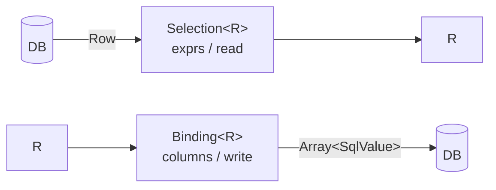
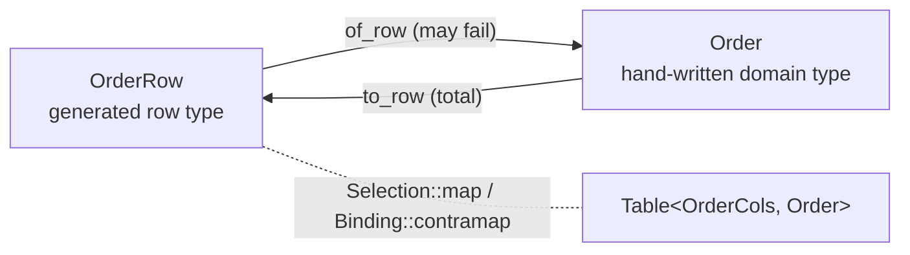

# 1. Table — defining what a row is

[← README](../README.md) · [Query →](02-query.md)

A `Table` is everything aya needs to read a row and to write one. Nothing
else in the library reaches for a schema: `from`, `insert`, `update` and
`delete` all start from a `Table` and get their column names, aliases and
codecs from it.

## The types

```moonbit
pub struct Table[Cols, R] {
  table_name : String      // the name in the database
  tbl        : String      // the alias used in FROM ... AS
  cols       : Cols        // typed column handles
  all        : Selection[R]  // read side: every column, in declaration order
  write      : Binding[R]    // write side: the mirror of `all`
}

pub fn[C, R] Table::new(
  table_name~ : String,
  tbl~ : String,
  cols~ : C,
  all~ : Selection[R],
  write~ : Binding[R],
) -> Table[C, R]
```

`Cols` is a struct of `Column[T]` fields, one per column — `UserCols` and
friends, emitted by the generator. `R` is what one row *is*, which may be the
generated row type or a domain type mapped onto it.

`tbl` is fixed per table rather than assigned per query, which is why a
self-join is not expressible yet: both sides would claim the same alias, and
`Query::to_sql` raises `DuplicateAlias` rather than emit ambiguous references.

## Selection and Binding are mirrors

```moonbit
pub struct Selection[Out] {
  exprs : Array[RawExpr]                   // which columns to read
  read  : (Row) -> Out raise DecodeError   // how to decode them, by position
}

pub struct Binding[In] {
  columns : Array[String]           // which columns to write
  write   : (In) -> Array[SqlValue] // how to encode them, in the same order
}
```



The two halves are one type each rather than two loose values because apart
they break the usual way: a column is added to the projection and the decoder
is not updated to match. `read` is **positional**, which is fragile by hand —
but a generator emits `exprs` and `read` from one pass over the same field
list, so they cannot drift.

Both come from that same field list, so a SELECT and an INSERT of the same
entity cannot disagree about what each position means.

### Combinators

```moonbit
pub fn[Out] Selection::new(Array[RawExpr], (Row) -> Out raise DecodeError) -> Selection[Out]
pub fn[A, B] Selection::zip(Selection[A], Selection[B]) -> Selection[(A, B)]
pub fn[A, B] Selection::map(Selection[A], (A) -> B raise DecodeError) -> Selection[B]
pub fn[A, B, R] Selection::into2(Selection[(A, B)], (A, B) -> R) -> Selection[R]
pub fn[A, B, C, R] Selection::into3(Selection[(A, B, C)], (A, B, C) -> R) -> Selection[R]
pub fn[Out] Selection::optional(Selection[Out]) -> Selection[Out?]
pub fn[Out] Selection::optional_on(Selection[Out], key~ : Int) -> Selection[Out?]

pub fn[In] Binding::new(Array[String], (In) -> Array[SqlValue]) -> Binding[In]
pub fn[In] Binding::without(Binding[In], Array[String]) -> Binding[In]
pub fn[A, B] Binding::contramap(Binding[A], (B) -> A) -> Binding[B]
```

`Selection::map` and `Binding::contramap` are the covariant and contravariant
halves of one idea, and together they are the seam described below.
`Binding::without` drops columns while keeping declaration order — the usual
reason being an auto-increment key the database has to assign.

Reading may fail and writing may not. That asymmetry is deliberate: a stored
row can hold combinations the MoonBit type rejects, but a MoonBit value always
flattens into a row.

## Values and codecs

```moonbit
pub(all) enum SqlValue {
  VNull
  VInt(Int64)
  VDouble(Double)
  VText(String)
  VBool(Bool)
  VBytes(Bytes)
}

pub(open) trait SqlEncode { fn to_sql_value(Self) -> SqlValue }
pub(open) trait SqlDecode { fn decode(SqlValue, String) -> Self raise DecodeError }
pub(open) trait SqlOrd {}   // marker: comparable and orderable
pub(open) trait SqlNum {}   // marker: SQL will do arithmetic on it
```

`Int`, `Int64`, `Double`, `String`, `Bool` and `T?` are covered. `SqlOrd` and
`SqlNum` carry no methods at all — they are constraints, not interfaces, and
exist only to keep `gt` off a `Column[Bool]` and `sum` off a `Column[String]`.

Nothing requires a column to be primitive. `Column[T]` accepts any `T` that
encodes and decodes, so a newtype or a closed enum can live in the row type
itself rather than behind a mapping layer:

```moonbit
pub(all) struct AccountId(Int) derive(Debug, Eq)

pub impl @aya.SqlEncode for AccountId with fn to_sql_value(self) {
  let AccountId(n) = self
  @aya.SqlEncode::to_sql_value(n)
}

pub impl @aya.SqlDecode for AccountId with fn decode(v, k) {
  AccountId(@aya.SqlDecode::decode(v, k))
}
```

Decoding is also where a domain invariant gets enforced: a value outside the
allowed set can `raise @aya.TypeMismatch(column=k, expected="Plan")` rather
than arrive as an untyped string.

## Generating the plumbing

The annotated struct is **the flat shape of one row** — not the thing the rest
of the program works with.

```moonbit
#aya.table(name="users", alias="u")
pub(all) struct User {
  #aya.id
  id : Int
  name : String
  age : Int
  deleted_at : String?
} derive(Debug, Eq)
```

| Attribute | Argument | Default | Effect |
|---|---|---|---|
| `#aya.table` | `name=` | required | table name in the database |
| | `alias=` | first letter of `name` | alias used in `FROM ... AS` |
| | `cols=` | `<TypeName>Cols` | name of the generated column-handle struct |
| `#aya.id` | — | — | marks the primary key; at most one per struct |
| `#aya.column` | `name=` | field name | column name in the database |

Unknown attribute names are ignored on purpose, so adding one later will not
break an older generator. `#aya.column` and `#aya.index` take further
arguments that describe storage rather than the generated MoonBit — SQL types,
defaults, constraints, foreign keys — collected in
[Schema and migrations](08-schema.md).

`pub(all)` matters: callers build values to hand to `insert`, and a plain `pub`
struct is read-only to them.

```bash
aya-kit codegen                                   # every entity file in aya.json
aya-kit codegen src/app/entities.mbt -o src/app/entities.g.mbt   # one file
```

| Generated | Type |
|---|---|
| `UserCols` | `struct { id : Column[Int], name : Column[String], .. }` |
| `User::cols()` | `-> UserCols` |
| `User::all(UserCols)` | `-> Selection[User]` |
| `User::binding()` | `-> Binding[User]` |
| `User::table()` | `-> Table[UserCols, User]` |
| `User::table_of(to, from)` | `-> Table[UserCols, D]` |
| `User::primary_key_name()` | `-> String?` |

The output is ordinary MoonBit source: readable, diffable, and checked by the
compiler like anything else.

Downstream, a `pre-build` hook in `moon.pkg` can call a prebuilt `aya-kit`.
**A hook that runs `moon run` inside the same module recurses forever**, so the
examples in this repository are generated explicitly.

## When the row type and the domain entity do not line up

This is the case aya is built around. If the domain models its states as a
sum type, it will not be 1-1 with the table: the row has to leave
`submitted_at` and `tracking` nullable, while the domain type can make each
state's fields unconditional.

```moonbit
#aya.table(name="orders", alias="o", cols="OrderCols")
pub(all) struct OrderRow {
  #aya.id
  id : Int
  items : Int
  status : String
  submitted_at : String?
  tracking : String?
}

pub(all) enum Order {
  Draft(id~ : Int, items~ : Int)
  Submitted(id~ : Int, items~ : Int, submitted_at~ : String)
  Shipped(id~ : Int, items~ : Int, submitted_at~ : String, tracking~ : String)
}
```

The mapping is written by hand. **This is the only place the domain knowledge
actually lives**, so it is the one part a generator has no business writing.

```moonbit
pub fn Order::of_row(r : OrderRow) -> Order raise @aya.DecodeError {
  match (r.status, r.submitted_at, r.tracking) {
    ("draft", _, _) => Draft(id=r.id, items=r.items)
    ("submitted", Some(at), _) => Submitted(id=r.id, items=r.items, submitted_at=at)
    ("shipped", Some(at), Some(t)) =>
      Shipped(id=r.id, items=r.items, submitted_at=at, tracking=t)
    _ => raise @aya.Malformed("orders id=\{r.id}: illegal stored state")
  }
}

pub fn Order::to_row(self : Order) -> OrderRow { ... }
```

`table_of` glues the two together into a **table typed by the domain entity**:

```moonbit
pub fn orders() -> @aya.Table[OrderCols, Order] {
  OrderRow::table_of(Order::of_row, Order::to_row)
}
```



From there both queries and DML speak `Order`; `OrderRow` never crosses the
boundary. Filters are still written against the *row's* columns, because that
is what the database has — only what comes back is governed by the domain type.

### What the seam does, row by row

**`orders`**

| id | items | status | submitted_at | tracking |
|---:|------:|--------|--------------|----------|
| 1 | 3 | shipped | 2026-08-01 | ZZ123 |
| 2 | 1 | draft | *NULL* | *NULL* |
| 3 | 2 | shipped | 2026-08-01 | *NULL* |

`@aya.from(orders()).run(db)` gives, for the first two rows:

| | |
|---|---|
| row 1 | `Shipped(id=1, items=3, submitted_at="2026-08-01", tracking="ZZ123")` |
| row 2 | `Draft(id=2, items=1)` |

Row 3 is the interesting one. The table happily stores a shipped order with no
tracking number; `Order` has no state for it; so `of_row` falls through to its
last arm and raises:

```
Malformed("orders id=3: status shipped with submitted_at=true tracking=false")
```

**That is the seam earning its keep** — the mismatch surfaces at the boundary,
naming the offending row, rather than becoming a `Shipped` with an empty string
in it.

Going the other way is total. `@aya.insert(orders(), Draft(id=4, items=2))`
writes all five columns, with `to_row` supplying the two NULLs in one place:

```sql
INSERT INTO "orders" ("id", "items", "status", "submitted_at", "tracking")
 VALUES (?, ?, ?, ?, ?)
-- parameters: [4, 2, "draft", NULL, NULL]
```

When the row type and the domain type do agree, skip all of this and use the
generated `User::table()` directly.

---

[← README](../README.md) · [Query →](02-query.md)
