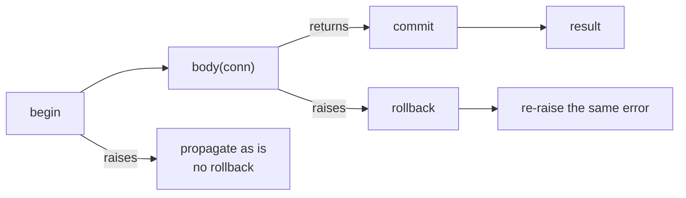
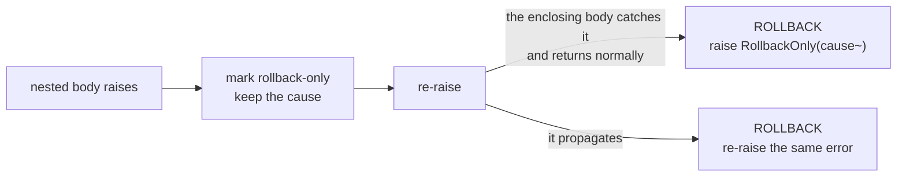

# 6. Execution

[← Aggregation](05-aggregate.md) · [Repository →](07-repository.md)

Everything above this chapter is dialect-agnostic: aya builds SQL text plus
an ordered parameter list. This chapter is about handing that pair to something
that can run it.

## Two traits, split on purpose

```moonbit
pub(open) trait Executor {
  async fn query(Self, String, Array[SqlValue], columns~ : Int) -> Array[Array[SqlValue]] raise DbError
  async fn execute(Self, String, Array[SqlValue]) -> Int raise DbError
  fn dialect(Self) -> Dialect
  fn row_shape(Self) -> RowShape = _   // defaults to Plain
}

pub(open) trait Driver : Executor {
  async fn begin(Self) -> Unit raise DbError
  async fn commit(Self) -> Unit raise DbError
  async fn rollback(Self) -> Unit raise DbError
}
```

`Executor` is all a *statement* needs: text, parameters, and the dialect they
were built for. Bracketing a transaction is a separate capability, and a
`Driver` is an `Executor` that also has it.

**The split is the point.** `run` / `one` / `first` are bounded by `Executor`,
and everything aya hands to the body of a transaction is an `Executor` and
nothing more — so code running inside a transaction cannot commit or roll back
the transaction it is running inside. Only `Tx` sends those three statements.

A driver *is* the connection. Pooling, if you want it, belongs outside.

`columns~` is the width of the **projection**, not of the SELECT list, which a
`Typed` driver writes twice as wide. A driver whose binding reports the result
width can ignore it.

### Why `async`

Of the two SQL client libraries MoonBit has, one is synchronous and the other
is not, and MoonBit has no polymorphism over asyncness — an `async` function
can only be called from an `async` function. A synchronous trait could not hold
the asynchronous client at all, while an asynchronous one holds both: a
synchronous driver implements an `async` method with an ordinary `fn`, since a
body that never suspends is a valid body.

So the trait is `async`, and so are `run` / `one` / `first` / `transaction`,
which means calling them needs an `async fn main` or an `async test`.

`async` itself compiles on every backend, so the query builder stays portable;
it is the two client libraries, and `moonbitlang/async` beneath them, that are
native-only.

## Running

```moonbit
pub async fn[E : Executor, C, A] Query::run(Query[C, A], E)   -> Array[A]
pub async fn[E : Executor, C, A] Query::one(Query[C, A], E)   -> A
pub async fn[E : Executor, C, A] Query::first(Query[C, A], E) -> A?

pub async fn[E : Executor]    Insert::run(Insert, E)    -> Int
pub async fn[E : Executor, C] Update::run(Update[C], E) -> Int
pub async fn[E : Executor, C] Delete::run(Delete[C], E) -> Int
```

| | Returns | On the wrong number of rows |
|---|---|---|
| `run` | every row | — |
| `one` | exactly one | `NotFound(sql~)` at zero, `TooManyRows(sql~, got~)` above one |
| `first` | the first, if any | — |
| DML `run` | rows affected | — |

Over a table typed by a domain entity, what comes back is domain values:

```moonbit
@sql.from(orders()).run(db)
// => [Shipped(id=1, items=3, submitted_at="2026-08-01", tracking="ZZ123"),
//     Draft(id=2, items=1)]
```

## Transactions

```moonbit
pub struct Tx[D] {
  db : D
  mut depth : Int        // 0 means nothing is open; the next scope must BEGIN
  mut failure : Error?   // what a nested scope failed with, if one did
}

pub fn[D] Tx::new(D) -> Tx[D]
pub fn[D] Tx::driver(Tx[D]) -> D
pub fn[D] Tx::is_open(Tx[D]) -> Bool

pub async fn[D : Driver, A] transaction(Tx[D], async (Tx[D]) -> A) -> A
```

**There is no transaction monad.** MoonBit's error effect does that job, so the
body is an ordinary function that may `raise` part way through.

```moonbit
let db = @sql.Tx::new(driver)

@sql.transaction(db, conn => {
  let removed = @sql.delete(orders(), o => o.id.eq(2)).run(conn)
  let added = @sql.insert(orders(), Submitted(id=2, items=1, submitted_at=at)).run(conn)
  (removed, added)
})
```

begin / commit / rollback are wrapped in a combinator rather than exposed
individually, so that a `raise` in the middle of the body cannot leave a
transaction open.



- The body returning means COMMIT; the body raising means ROLLBACK and then
  **re-raising the same error**
- A rollback that itself fails **does not swallow the original error**, since
  the cause is the more useful of the two
- If `begin` fails there is nothing to undo, so no ROLLBACK is sent

All three are pinned by tests (`["BEGIN", "EXEC", "EXEC", "COMMIT"]`,
`["BEGIN", "EXEC", "ROLLBACK"]`, `[]`).

### Why a `Tx` rather than the driver

A `Tx` is the driver plus one number — how deep into nested transactions this
connection currently is — and that number is what lets **calls nest**.

Only the outermost scope sends `BEGIN` and `COMMIT`. An inner one runs its body
and nothing else, so two operations that each insist on being atomic land in
one transaction when something wraps them:

```moonbit
@sql.transaction(db, _ => {
  tickets.save(a)   // save brackets its own work...
  users.save(b)     // ...but here both join the enclosing transaction
})
// => ["BEGIN", "QUERY", "EXEC", "QUERY", "EXEC", "COMMIT"]
```

Run on its own, that same `save` *is* the outermost scope and brackets itself.
A repository never has to know which case it is in — which is why nothing about
a transaction is passed as an argument.

Hand **the same `Tx`** to every repository over that connection, once, at
wiring time. Two different `Tx` values over one connection will ask the
database to `BEGIN` twice, which SQLite rejects outright.

### An inner scope cannot fail by itself

There is no savepoint underneath this, so there is no way to undo only one
scope's writes. A nested failure therefore marks the whole transaction
rollback-only, and if the body catches it and carries on, the outermost scope
refuses to commit:



Committing instead would write whichever half of the work happened to survive.
`RollbackOnly` carries the failure that made the commit impossible, not the
fact that someone swallowed it. The poison is scoped to the transaction, not to
the connection: the next one starts clean.

A `Tx` counts one connection's position in one call stack, so it is **not safe
to share between concurrently running tasks**.

## Failures

```moonbit
pub(all) suberror DbError {
  ConnectionFailed(String)
  QueryFailed(sql~ : String, message~ : String)
  NotFound(sql~ : String)
  TooManyRows(sql~ : String, got~ : Int)
  RollbackOnly(cause~ : Error)
}
```

`DbError` is what the database said; [`StatementError`](03-dml.md) is the
statement being malformed before it ever left; `DecodeError` is a stored value
not fitting the type the entity declared for it.

## Drivers

| Package | Backing library | Row shape |
|---|---|---|
| `@fake` (`src/driver/fake`) | none — records statements, replays canned rows | `Plain` |
| `@sqlite` (`src/driver/sqlite`) | [`moonbit-community/sqlite3`](https://github.com/moonbit-community/sqlite3.mbt) | `Typed` |
| `@postgres` (`src/driver/postgres`) | [`moonbit-community/postgres`](https://github.com/moonbit-community/postgres.mbt) | `Plain` |

```moonbit
@sqlite.with_connection(":memory:", db => {
  let tickets = @sql.from(TicketRow::table()).run(db)
  ...
})

@postgres.with_connection(
  @postgres.config(host="localhost", user="alliana", database="aya"),
  db => {
    let tickets = @sql.from(TicketRow::table()).run(db)
    ...
  },
)
```

`with_connection` exists because the PostgreSQL client splits a connection into
a `Client` that statements go through and a `Connection` whose `run` drives the
protocol underneath it. Nothing happens unless something drives that pump, so
it is spawned for you and the connection is closed however the body ends.

The two translations either side of the wire are the whole of a driver. Going
out, the *server* decides what type each placeholder has, so aya's
`VInt(Int64)` is encoded at whatever width the column turned out to be. Coming
back, the row description names each column's type, so a `SqlValue` of the
matching shape can be built — aya's decoders match on the constructor, and a
guess would be a silent wrong answer. PostgreSQL types aya has no shape for
(dates, timestamps, uuid) are refused by name rather than guessed at; cast them
in the query, as in `submitted_at::text`.

### Why `RowShape`

```moonbit
pub(all) enum RowShape { Plain; Typed }
```

The SQLite binding is deliberately thin: it hands back whatever you ask a
column for, and has no public way to report a column's type or to say `NULL`.
Ask it for a column as an `Int` and a NULL arrives as `0` — a real value, and
the wrong one. That is a silent wrong answer in the middle of an otherwise
type-safe path, so the type is asked of the database rather than guessed.

A driver declares which shape of SELECT list it needs, and aya writes it:

```sql
-- RowShape::Plain, what a driver that can describe a result row needs
SELECT i."id", t."tag" FROM "items" AS i LEFT JOIN "tags" AS t ON ...

-- RowShape::Typed, what the SQLite driver declares
SELECT typeof(i."id"), i."id", typeof(t."tag"), t."tag" FROM ...
```

The driver folds each pair back into one `SqlValue`, so nothing above it sees
the doubled list — which is also why `query` is told `columns~`. Each projected
expression is rendered **once** and its text reused, since rendering it twice
would bind any literal in it twice and shift every later placeholder.

The tag SQLite returns is the value's storage class, not the column's declared
type, so a column declared `INTEGER` holding text reads back as text — which is
what is actually stored.

Going the other way, a `VNull` parameter is simply not bound. SQLite reads an
unbound parameter as NULL, and that is the only way to send one through this
binding.

Both gaps are one small change away in the binding itself — `internal/ffi`
already has `sqlite3_column_type` and `sqlite3_bind_null`, they are just not
public — so this may become unnecessary upstream.

### Testing without a database

`@fake.FakeDb` implements the same traits and records what it was asked to run.

```moonbit
pub fn FakeDb::new(
  results? : Array[Array[Array[SqlValue]]],  // fed to successive `query` calls
  counts? : Array[Int],                      // fed to successive `execute` calls
  dialect? : Dialect,
) -> FakeDb

pub fn FakeDb::fail(FakeDb, String, after? : Int) -> Unit
```

```moonbit
let db = @fake.FakeDb::new(counts=[1, 1])
let repo = SqlTickets::new(@sql.Tx::new(db))
repo.save(Open(id=1, subject="printer on fire"))
db.log  // ["BEGIN", "QUERY", "EXEC", "COMMIT"]
```

Running past the end of `results` or `counts` yields an empty result set and a
row count of zero rather than failing, so a test only has to spell out the
statements it cares about. `fail(message, after~)` arms a one-shot failure so a
test can break the *second* write of a transaction and still watch the rollback
go out; `begin`, `commit` and `rollback` are neither counted nor failed, since
a rollback that could itself fail would drown out the error under test.

---

[← Aggregation](05-aggregate.md) · [Repository →](07-repository.md)
