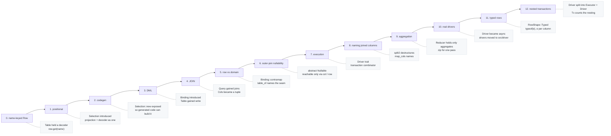

# 9. Design notes

[← Schema](08-schema.md) · [README](../README.md)

Why the types are shaped the way they are, what is deliberately absent, and
what is simply not built yet.

## How the types got here

| Step | Change | Why |
|---|---|---|
| 0 | `Table { cols, decoder }`, `Row` a map from column name to value | first sketch |
| 1 | `Row = ArrayView[SqlValue]`, `Selection[Out]` carries projection and decoder, `Table { .., all }` | projection order and decode order can no longer disagree |
| 2 | `Selection::new` made public | generated code lives in another package and has to build one |
| 3 | `Binding[In]` added, `Table { .., write }` | INSERT needs the value-to-row direction |
| 4 | `Query { .., joins }`, `Query::join` makes `Cols` a tuple | more than one table |
| 5 | `Binding::contramap` added, generator emits `table_of`, attribute became `#cairn.table` | the row type and the domain type are different things, and the mapping is written by hand |
| 6 | `left_join` returns the abstract `Nullable[C, R]`, `Selection::optional` added | make outer-join nullability enforced by the type |
| 7 | `Driver` trait and `transaction`, `run` / `one` / `first` on every statement | build the SQL *and* run it |
| 8 | `split2` and `Query::map_cols` added | stand in for the lambda destructuring MoonBit lacks |
| 9 | `Reducer[Out]` with `Query::reduce` / `group_by` | make an invalid aggregate query unwritable |
| 10 | `Driver` and `run` / `one` / `first` / `transaction` became `async`, drivers moved to `src/driver` | the PostgreSQL client for MoonBit is async, and a synchronous trait cannot hold it |
| 11 | `RowShape` on `Driver`, `columns~` on `query` | the SQLite binding reports neither a result column's type nor its nullness, and guessing would be a silent wrong answer |
| 12 | `Driver` split into `Executor` + `Driver : Executor`, `Tx[D]` added, `transaction` takes a `Tx` | two repositories that each bracket their own work must not send `BEGIN` twice, and a transaction body has no business committing |

## Three recurring moves

Most of the API follows one of these.

**Pair the thing with how to read it.** `Selection` binds "which columns" to
"how to decode them"; `Binding` does the same on the way out; `Reducer` does it
for aggregates. Kept apart, the two halves drift — a column is added to the
projection and the decoder is not updated. A generator emits both from one pass
over the same field list, so in practice they cannot.

**Make the illegal state unrepresentable, or make it loud.** `Reducer` is
opaque so a bare column cannot be projected next to an aggregate. `Nullable`
has no exposed representation, so the nullability an outer join introduces
cannot be lost. Where the type cannot say it — a shipped order with no tracking
number, a stored row the domain type has no state for — the mapping `raise`s
instead.

**Require the dangerous argument.** `update` and `delete` take their predicate
as a positional argument rather than a chained step, because a step can be
forgotten and forgetting it rewrites the table. `update_all` and `delete_all`
exist so that the unfiltered case is visible at the call site by name.

## Where it errs on the safe side

| Situation | Behaviour |
|---|---|
| INSERT with no rows | raises `EmptyInsert` |
| UPDATE with no assignment | raises `EmptyUpdate` |
| column count not matching value count | raises `ArityMismatch` |
| joining on a repeated alias (self-join) | raises `DuplicateAlias` |
| UPDATE / DELETE without a predicate | you must call `update_all` / `delete_all` |
| `one` finding zero or several rows | raises `NotFound` / `TooManyRows` |
| a transaction body failing | ROLLBACK, then the same error is re-raised |
| a nested transaction failing and the enclosing body carrying on | ROLLBACK, then `RollbackOnly` carrying the original cause |
| a column read as a type it does not hold | raises `TypeMismatch` |
| a NULL where a driver would otherwise report `0` | `RowShape::Typed` asks the database for the type |

## Not built yet

- **Aliasing and self-joins** — the `Column`s inside `Cols` bake in the alias,
  so `Table` would need to hold `cols` as `(String) -> Cols`
- **A security type parameter** — `Table[Sec, Cols, R]`, matching Acadia's
  `Table Unrestricted Food`. The `#cairn.table(security=...)` slot is reserved
- **PostgreSQL DDL** — the type table is there, but `generate` emits SQLite.
  Postgres needs less work than SQLite did, since its `ALTER TABLE` is honest
- **Applying migrations** — no `migrate` subcommand runs the `.sql` files
  through an `Executor` yet
- **Composite primary keys and multi-column unique constraints** — `#cairn.id`
  marks one column
- **Subqueries and CTEs** — `RawExpr` has no constructor for a nested SELECT
- **`RETURNING`** — DML reports a row count and nothing else

## About the examples

`src/example` deliberately keeps two entities and no more:

| | Shows |
|---|---|
| `entities.mbt` — `User` | the plain case: the generated table used directly |
| `orders.mbt` — `OrderRow` / `Order` | the seam: a row type and a domain sum type mapped through `table_of` |

Everything else worth demonstrating is pinned where it is implemented rather
than duplicated here: joins, `Nullable`, `map_cols` and `split2` in
`src/sql/join_test.mbt`; aggregation in `src/sql/reducer_test.mbt`; nested
transactions in `src/driver/fake/fake_test.mbt` and against a real database in
`src/driver/sqlite/sqlite_test.mbt`.

## About the generator

The generator parses MoonBit source with
[`moonbitlang/parser`](https://mooncakes.io/docs/moonbitlang/parser).
Attributes are read from the raw text in `Attribute.raw`, because `parsed` is
not populated for user-defined namespaces and `name()` drops the namespace
(`#cairn.id` and `#morm.id` both report `"id"`).

String in, string out: file IO stays in the CLI, so the whole parse/lower/emit
pipeline is testable without touching the filesystem.

---

[← Schema](08-schema.md) · [README](../README.md)
