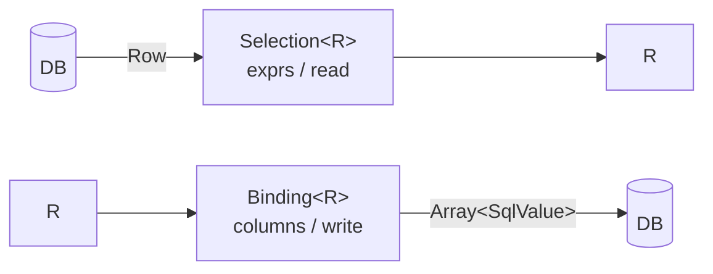
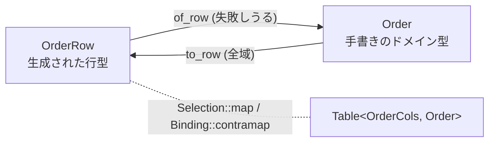

# 1. Table — 行とは何かを定義する

[← README](../../README_ja.md) · [Query →](02-query.md)

`Table` は、1 行を読むために必要なものと書くために必要なものをすべて持ちます。
ライブラリの他の部分がスキーマに手を伸ばすことはありません。`from` / `insert` /
`update` / `delete` はいずれも `Table` から始まり、列名・エイリアス・コーデックを
そこから受け取ります。

## 型

```moonbit
pub struct Table[Cols, R] {
  table_name : String        // データベース上の名前
  tbl        : String        // FROM ... AS で使うエイリアス
  cols       : Cols          // 型付きカラムハンドル
  all        : Selection[R]  // 読み側: 宣言順の全列
  write      : Binding[R]    // 書き側: all の鏡像
}

pub fn[C, R] Table::new(
  table_name~ : String,
  tbl~ : String,
  cols~ : C,
  all~ : Selection[R],
  write~ : Binding[R],
) -> Table[C, R]
```

`Cols` は 1 列につき 1 フィールドの `Column[T]` を持つ構造体です — `UserCols`
などで、ジェネレータが出力します。`R` は「1 行が何であるか」で、生成された行型でも、
その上に対応づけたドメイン型でも構いません。

`tbl` はクエリごとではなくテーブルごとに固定です。だからこそ自己結合はまだ
書けません。両辺が同じエイリアスを主張することになり、`Query::to_sql` は
曖昧な参照を吐く代わりに `DuplicateAlias` を送出します。

## Selection と Binding は鏡像

```moonbit
pub struct Selection[Out] {
  exprs : Array[RawExpr]                   // どの列を読むか
  read  : (Row) -> Out raise DecodeError   // それを位置でどうデコードするか
}

pub struct Binding[In] {
  columns : Array[String]           // どの列に書くか
  write   : (In) -> Array[SqlValue] // 同じ順序でどうエンコードするか
}
```



2 つの半身を別々の値ではなくそれぞれ 1 つの型にまとめているのは、離しておくと
決まったやり方で壊れるからです。射影に列を足してデコーダを直し忘れる、というやつです。
`read` は**位置ベース**で、手で書くと脆い — けれどもジェネレータは同じフィールド列を
1 回走査して `exprs` と `read` の両方を吐くので、両者がずれることはありません。

どちらも同じフィールド列に由来するので、同一エンティティの SELECT と INSERT が
「各位置が何を意味するか」で食い違うことはありません。

### コンビネータ

```moonbit
pub fn[Out] Selection::new(Array[RawExpr], (Row) -> Out raise DecodeError) -> Selection[Out]
pub fn[A, B] Selection::zip(Selection[A], Selection[B]) -> Selection[(A, B)]
pub fn[A, B] Selection::map(Selection[A], (A) -> B raise DecodeError) -> Selection[B]
pub fn[A, B, R] Selection::into2(Selection[(A, B)], (A, B) -> R) -> Selection[R]
pub fn[A, B, C, R] Selection::into3(Selection[(A, B, C)], (A, B, C) -> R) -> Selection[R]
pub fn[Out] Selection::optional(Selection[Out]) -> Selection[Out?]
pub fn[Out] Selection::optional_on(Selection[Out], key~ : Int) -> Selection[Out?]

pub fn[In] Binding::new(Array[String], (In) -> Array[SqlValue]) -> Binding[In]
pub fn[In] Binding::without(Binding[In], Array[String]) -> Binding[In]
pub fn[A, B] Binding::contramap(Binding[A], (B) -> A) -> Binding[B]
```

`Selection::map` と `Binding::contramap` は 1 つの考えの共変側と反変側であり、
2 つ揃って後述の「継ぎ目」になります。`Binding::without` は宣言順を保ったまま列を
落とします。主な用途は、データベースに採番させたい自動採番キーです。

**読みは失敗しうるが、書きは失敗しない。** この非対称は意図的です。保存された行は
MoonBit の型が拒む組み合わせを持ちうる一方、MoonBit の値は必ず 1 行に平坦化できます。

## 値とコーデック

```moonbit
pub(all) enum SqlValue {
  VNull
  VInt(Int64)
  VDouble(Double)
  VText(String)
  VBool(Bool)
  VBytes(Bytes)
}

pub(open) trait SqlEncode { fn to_sql_value(Self) -> SqlValue }
pub(open) trait SqlDecode { fn decode(SqlValue, String) -> Self raise DecodeError }
pub(open) trait SqlOrd {}   // マーカー: 比較・整列できる
pub(open) trait SqlNum {}   // マーカー: SQL が算術演算をする
```

`Int` / `Int64` / `Double` / `String` / `Bool` / `T?` は実装済みです。`SqlOrd` と
`SqlNum` はメソッドを一切持ちません。インタフェースではなく制約であり、
`Column[Bool]` に `gt` を、`Column[String]` に `sum` を生やさないためだけに
存在します。

列がプリミティブである必要はありません。`Column[T]` はエンコード・デコードできる
任意の `T` を受け取るので、ニュータイプや閉じた列挙をマッピング層の向こう側ではなく
行型そのものに置けます。

```moonbit
pub(all) struct AccountId(Int) derive(Debug, Eq)

pub impl @sql.SqlEncode for AccountId with fn to_sql_value(self) {
  let AccountId(n) = self
  @sql.SqlEncode::to_sql_value(n)
}

pub impl @sql.SqlDecode for AccountId with fn decode(v, k) {
  AccountId(@sql.SqlDecode::decode(v, k))
}
```

デコードはドメイン不変条件を強制する場所でもあります。許された集合の外の値は、
型のない文字列として素通りするのではなく
`raise @sql.TypeMismatch(column=k, expected="Plan")` で落とせます。

## 配管を生成する

注釈を付けた構造体は**1 行の平坦な形**であって、プログラムの他の部分が扱うものでは
ありません。

```moonbit
#cairn.table(name="users", alias="u")
pub(all) struct User {
  #cairn.id
  id : Int
  name : String
  age : Int
  deleted_at : String?
} derive(Debug, Eq)
```

| 属性 | 引数 | 既定値 | 効果 |
|---|---|---|---|
| `#cairn.table` | `name=` | 必須 | データベース上のテーブル名 |
| | `alias=` | `name` の頭 1 文字 | `FROM ... AS` で使うエイリアス |
| | `cols=` | `<型名>Cols` | 生成されるカラムハンドル構造体の名前 |
| `#cairn.id` | — | — | 主キー。1 構造体につき最大 1 つ |
| `#cairn.column` | `name=` | フィールド名 | データベース上の列名 |

未知の属性名は意図的に無視します。あとから属性を追加しても古いジェネレータを
壊さないためです。

`pub(all)` であることが重要です。呼び出し側は `insert` に渡す値を組み立てるので、
ただの `pub` 構造体では読み取り専用になってしまいます。

```bash
moon run src/gen/cmd -- src/app/entities.mbt -o src/app/entities.g.mbt
```

| 生成されるもの | 型 |
|---|---|
| `UserCols` | `struct { id : Column[Int], name : Column[String], .. }` |
| `User::cols()` | `-> UserCols` |
| `User::all(UserCols)` | `-> Selection[User]` |
| `User::binding()` | `-> Binding[User]` |
| `User::table()` | `-> Table[UserCols, User]` |
| `User::table_of(to, from)` | `-> Table[UserCols, D]` |
| `User::primary_key_name()` | `-> String?` |

出力はふつうの MoonBit ソースです。読めて、diff が取れて、他のコードと同じように
コンパイラに検査されます。

利用側では `moon.pkg` の `pre-build` フックからビルド済みの `cairn-gen` を呼べます。
**同一モジュール内で `moon run` するフックは無限に再帰する**ので、このリポジトリの
例は明示的に生成しています。

## 行型とドメインエンティティが食い違うとき

cairn が念頭に置いているのはこの場合です。ドメインが状態を直和型で表すなら、
テーブルとは 1 対 1 になりません。行のほうは `submitted_at` と `tracking` を
NULL 許容にせざるを得ない一方、ドメイン型は各状態のフィールドを無条件にできます。

```moonbit
#cairn.table(name="orders", alias="o", cols="OrderCols")
pub(all) struct OrderRow {
  #cairn.id
  id : Int
  items : Int
  status : String
  submitted_at : String?
  tracking : String?
}

pub(all) enum Order {
  Draft(id~ : Int, items~ : Int)
  Submitted(id~ : Int, items~ : Int, submitted_at~ : String)
  Shipped(id~ : Int, items~ : Int, submitted_at~ : String, tracking~ : String)
}
```

対応づけは手で書きます。**ドメイン知識が実際に宿るのはここだけ**であり、だからこそ
ジェネレータが書くべきではない部分です。

```moonbit
pub fn Order::of_row(r : OrderRow) -> Order raise @sql.DecodeError {
  match (r.status, r.submitted_at, r.tracking) {
    ("draft", _, _) => Draft(id=r.id, items=r.items)
    ("submitted", Some(at), _) => Submitted(id=r.id, items=r.items, submitted_at=at)
    ("shipped", Some(at), Some(t)) =>
      Shipped(id=r.id, items=r.items, submitted_at=at, tracking=t)
    _ => raise @sql.Malformed("orders id=\{r.id}: illegal stored state")
  }
}

pub fn Order::to_row(self : Order) -> OrderRow { ... }
```

`table_of` が両者を貼り合わせて、**ドメインエンティティで型付けされたテーブル**を
作ります。

```moonbit
pub fn orders() -> @sql.Table[OrderCols, Order] {
  OrderRow::table_of(Order::of_row, Order::to_row)
}
```



ここから先はクエリも DML も `Order` を話します。`OrderRow` が境界を越えることは
ありません。絞り込みは依然として**行の列**に対して書きます。データベースが
持っているのはそれだからです。返ってくる型を決めるのがドメイン型のほうです。

### 継ぎ目が行ごとに何をするか

**`orders`**

| id | items | status | submitted_at | tracking |
|---:|------:|--------|--------------|----------|
| 1 | 3 | shipped | 2026-08-01 | ZZ123 |
| 2 | 1 | draft | *NULL* | *NULL* |
| 3 | 2 | shipped | 2026-08-01 | *NULL* |

`@sql.from(orders()).run(db)` は、はじめの 2 行についてこうなります。

| | |
|---|---|
| 1 行目 | `Shipped(id=1, items=3, submitted_at="2026-08-01", tracking="ZZ123")` |
| 2 行目 | `Draft(id=2, items=1)` |

面白いのは 3 行目です。テーブルは追跡番号のない出荷済み注文を平然と保存できますが、
`Order` にはそれに対応する状態がありません。したがって `of_row` は最後の腕まで
落ち、次を送出します。

```
Malformed("orders id=3: status shipped with submitted_at=true tracking=false")
```

**これが継ぎ目の働きです** — 食い違いが該当行を名指ししたうえで境界に表面化するので
あって、空文字列を詰めた `Shipped` になったりはしません。

逆方向は全域です。`@sql.insert(orders(), Draft(id=4, items=2))` は 5 列すべてを
書き、必要な NULL 2 つは `to_row` が 1 か所で供給します。

```sql
INSERT INTO "orders" ("id", "items", "status", "submitted_at", "tracking")
 VALUES (?, ?, ?, ?, ?)
-- パラメータ: [4, 2, "draft", NULL, NULL]
```

行型とドメイン型が一致するなら、以上はすべて飛ばして生成された `User::table()` を
そのまま使ってください。

---

[← README](../../README_ja.md) · [Query →](02-query.md)
