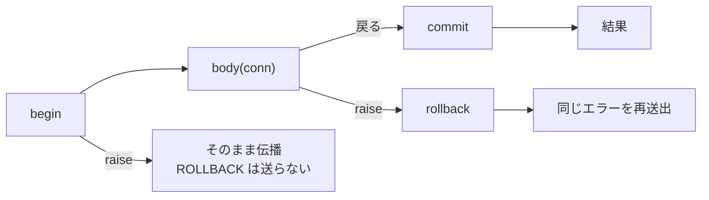
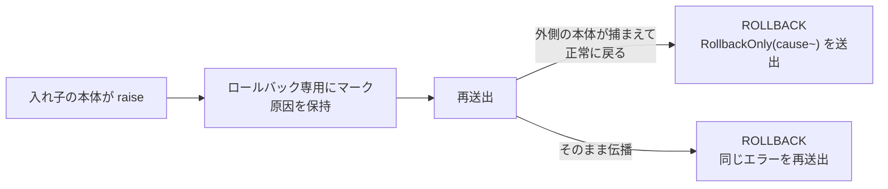

# 6. 実行

[← 集約](05-aggregate.md) · [Repository →](07-repository.md)

この章より上はすべて方言非依存です。aya が作るのは SQL 文字列と順序付きパラメータ列
だけでした。この章は、その組を実行できる何かに渡す話です。

## 意図的に分けた 2 つのトレイト

```moonbit
pub(open) trait Executor {
  async fn query(Self, String, Array[SqlValue], columns~ : Int) -> Array[Array[SqlValue]] raise DbError
  async fn execute(Self, String, Array[SqlValue]) -> Int raise DbError
  fn dialect(Self) -> Dialect
}

pub(open) trait Driver : Executor {
  async fn begin(Self) -> Unit raise DbError
  async fn commit(Self) -> Unit raise DbError
  async fn rollback(Self) -> Unit raise DbError
}
```

`Executor` は**文**が必要とするすべて — 文字列、パラメータ、それが組み立てられた
方言 — です。トランザクションで括ることは別の能力であり、`Driver` は「それも持つ
`Executor`」です。

**この分割こそが要点です。** `run` / `one` / `first` の境界は `Executor` であり、
aya がトランザクション本体に渡すものも `Executor` でしかありません。だから
トランザクションの中で走るコードは、自分が走っているトランザクションをコミットも
ロールバックもできません。この 3 文を送るのは `Tx` だけです。

ドライバは接続そのものです。プーリングが要るならその外側の仕事です。

`columns~` は 1 行が返すべき値の個数です。結果の幅をバインディングが報告できる
ドライバはこの引数を無視して構いません。報告できないドライバ — SQLite が
そうです — には、行がどこで終わるかを伝える必要があります。

### なぜ `async` なのか

MoonBit にある 2 つの SQL クライアントライブラリは、片方が同期でもう片方が非同期です。
そして MoonBit には非同期性に対する多相がありません — `async` 関数は `async` 関数
からしか呼べません。同期のトレイトでは非同期クライアントをそもそも保持できませんが、
非同期のトレイトなら両方を保持できます。同期ドライバは `async` メソッドをふつうの
`fn` で実装できます。決してサスペンドしない本体も正当な本体だからです。

そのためトレイトは `async` であり、`run` / `one` / `first` / `transaction` も
そうなります。つまり呼び出しには `async fn main` か `async test` が必要です。

`async` 自体はすべてのバックエンドでコンパイルできるので、クエリビルダは可搬なままです。
ネイティブ限定なのは 2 つのクライアントライブラリと、その下の `moonbitlang/async` です。

## 実行する

```moonbit
pub async fn[E : Executor, C, A] Query::run(Query[C, A], E)   -> Array[A]
pub async fn[E : Executor, C, A] Query::one(Query[C, A], E)   -> A
pub async fn[E : Executor, C, A] Query::first(Query[C, A], E) -> A?

pub async fn[E : Executor]    Insert::run(Insert, E)    -> Int
pub async fn[E : Executor, C] Update::run(Update[C], E) -> Int
pub async fn[E : Executor, C] Delete::run(Delete[C], E) -> Int
```

| | 返すもの | 行数が想定外のとき |
|---|---|---|
| `run` | 全行 | — |
| `one` | ちょうど 1 行 | 0 件で `NotFound(sql~)`、2 件以上で `TooManyRows(sql~, got~)` |
| `first` | 先頭 1 行（あれば） | — |
| DML の `run` | 影響行数 | — |

ドメインエンティティで型付けされたテーブルに対しては、返ってくるのはドメインの値です。

```moonbit
@aya.from(orders()).run(db)
// => [Shipped(id=1, items=3, submitted_at="2026-08-01", tracking="ZZ123"),
//     Draft(id=2, items=1)]
```

## トランザクション

```moonbit
pub struct Tx[D] {
  db : D
  mut depth : Int        // 0 なら何も開いていない。次のスコープが BEGIN する
  mut failure : Error?   // 入れ子のスコープが失敗していれば、その原因
}

pub fn[D] Tx::new(D) -> Tx[D]
pub fn[D] Tx::driver(Tx[D]) -> D
pub fn[D] Tx::is_open(Tx[D]) -> Bool

pub async fn[D : Driver, A] transaction(Tx[D], async (Tx[D]) -> A) -> A
```

**トランザクションモナドはありません。** MoonBit のエラーエフェクトがその役目を
果たすので、本体は途中で `raise` しうるふつうの関数です。

```moonbit
let db = @aya.Tx::new(driver)

@aya.transaction(db, conn => {
  let removed = @aya.delete(orders(), o => o.id.eq(2)).run(conn)
  let added = @aya.insert(orders(), Submitted(id=2, items=1, submitted_at=at)).run(conn)
  (removed, added)
})
```

begin / commit / rollback を個別に公開せずコンビネータに包んでいるのは、本体の
途中の `raise` がトランザクションを開いたまま残せないようにするためです。



- 本体が戻れば COMMIT、本体が raise すれば ROLLBACK して**同じエラーを再送出**
- ロールバック自体が失敗しても**元のエラーを握り潰さない**。原因のほうが有用だから
- `begin` が失敗したら取り消すものがないので、ROLLBACK は送らない

3 つともテストで固定してあります（`["BEGIN", "EXEC", "EXEC", "COMMIT"]`,
`["BEGIN", "EXEC", "ROLLBACK"]`, `[]`）。

### なぜドライバではなく `Tx` を取るのか

`Tx` は「ドライバ + 数値 1 つ」— この接続がいま入れ子のトランザクションのどれだけ
深くにいるか — であり、その数値が**呼び出しの入れ子**を可能にしています。

BEGIN と COMMIT を送るのは最も外側のスコープだけです。内側は本体を走らせるだけなので、
それぞれが原子性を要求する 2 つの操作が、何かに包まれたときは 1 つのトランザクションに
収まります。

```moonbit
@aya.transaction(db, _ => {
  tickets.save(a)   // save は自分の仕事を括るが……
  users.save(b)     // ……ここでは両方が外側のトランザクションに合流する
})
// => ["BEGIN", "QUERY", "EXEC", "QUERY", "EXEC", "COMMIT"]
```

単独で走らせれば、その同じ `save` が最外スコープになり自分で括ります。Repository は
自分がどちらの場合にいるかを知る必要がありません — トランザクションについて何も
引数で渡さないのはそのためです。

同じ接続に対する Repository には、配線時に一度、**同じ `Tx`** を渡してください。
1 つの接続に対して 2 つの異なる `Tx` を持たせると、データベースに `BEGIN` を 2 回
要求することになり、SQLite はこれを明確に拒否します。

### 内側のスコープは単独では失敗できない

この下にセーブポイントはないので、1 つのスコープの書き込みだけを取り消す方法が
ありません。したがって入れ子の失敗はトランザクション全体をロールバック専用に
マークし、本体がそれを捕まえて処理を続けた場合、最外スコープはコミットを拒みます。



コミットしてしまえば、たまたま生き残ったほうの半分が書き込まれます。`RollbackOnly`
が運ぶのはコミットを不可能にした失敗であって、誰かがそれを握り潰したという事実では
ありません。この毒は接続ではなくトランザクションにスコープされます。次のものは
きれいな状態で始まります。

`Tx` が数えているのは 1 接続の 1 コールスタック上の位置なので、
**並行に走るタスク間で共有するのは安全ではありません**。

## 失敗

```moonbit
pub(all) suberror DbError {
  ConnectionFailed(String)
  QueryFailed(sql~ : String, message~ : String)
  NotFound(sql~ : String)
  TooManyRows(sql~ : String, got~ : Int)
  RollbackOnly(cause~ : Error)
}
```

`DbError` はデータベースが言ったこと、[`StatementError`](03-dml.md) は文が
送り出される前から不正だったこと、`DecodeError` は保存された値がエンティティの
宣言した型に収まらなかったことです。

## 同梱ドライバ

| パッケージ | 依存ライブラリ |
|---|---|
| `@fake` (`src/driver/fake`) | なし — 文を記録し、用意した行を返す |
| `@sqlite` (`src/driver/sqlite`) | [`moonbit-community/sqlite3`](https://github.com/moonbit-community/sqlite3.mbt) |
| `@postgres` (`src/driver/postgres`) | [`moonbit-community/postgres`](https://github.com/moonbit-community/postgres.mbt) |

```moonbit
@sqlite.with_connection(":memory:", db => {
  let tickets = @aya.from(TicketRow::table()).run(db)
  ...
})

@postgres.with_connection(
  @postgres.config(host="localhost", user="alliana", database="aya"),
  db => {
    let tickets = @aya.from(TicketRow::table()).run(db)
    ...
  },
)
```

`with_connection` があるのは、PostgreSQL クライアントが接続を 2 つに分けている
からです。文が通る `Client` と、その下でプロトコルを回す `run` を持つ `Connection`
です。そのポンプを誰かが回さないと何も起きないので、aya 側で spawn し、本体が
どう終わっても接続を閉じます。

ワイヤの両側の 2 つの変換がドライバのすべてです。出ていく側では、各プレースホルダの
型を決めるのは**サーバ**なので、aya の `VInt(Int64)` は列の実際の幅に合わせて
エンコードされます。返ってくる側では row description が各列の型を教えてくれるので、
対応する形の `SqlValue` を組み立てられます。aya のデコーダはコンストラクタで
マッチするので、当て推量は黙って誤った答えになるところでした。aya に対応する形の
ない PostgreSQL の型（日付・タイムスタンプ・uuid）は推測せず名前で拒否します。
`submitted_at::text` のようにクエリ側でキャストしてください。

### SQLite ドライバはどう列を読むのか

かつての `moonbit-community/sqlite3` は「聞かれた型で列を返す」だけで、列の型を
報告する公開手段も `NULL` を伝える手段もありませんでした。ある列を `Int` として
聞くと NULL は `0` として返ってきます — 実在する値で、しかも誤った値です。
aya はこれを、SELECT リストを `typeof(e), e` の対で書き、ドライバ側で畳み戻す
という回避策で塞いでいました。ドライバが宣言する `RowShape` がその指示でした。

`0.2.0` はこの 2 つの穴を型 1 つで塞ぎました。

```moonbit
pub(all) enum Value { Null; Integer(Int64); Real(Double); Text(String); Blob(Bytes) }
```

`Bind` と `Column` の両方を実装するので、ストレージクラスが両方向をそのまま
渡っていき、ドライバは行き帰りともただの変換になります。2 倍幅の SELECT リストも、
それを要求するための `RowShape` も、どちらも不要になりました。`query` に
`columns~` を渡すのは続いています。結果行の幅をバインディングが報告しないからです。

列が報告するクラスは列の宣言型ではなく値のストレージクラスです。したがって
`INTEGER` と宣言された列がテキストを保持していればテキストとして読めます。
実際に保存されているものがそれだからです。

逆方向では、`VNull` のパラメータは `Value::Null` としてバインドされます。以前は
単にバインドせず、「バインドされていないパラメータを SQLite は NULL として読む」
という性質に頼っていました。旧バインディングで NULL を送る唯一の方法がそれでした。

### データベースなしでテストする

`@fake.FakeDb` は同じトレイトを実装し、実行を依頼された内容を記録します。

```moonbit
pub fn FakeDb::new(
  results? : Array[Array[Array[SqlValue]]],  // 各 query 呼び出しに順に渡る
  counts? : Array[Int],                      // 各 execute 呼び出しに順に渡る
  dialect? : Dialect,
) -> FakeDb

pub fn FakeDb::fail(FakeDb, String, after? : Int) -> Unit
```

```moonbit
let db = @fake.FakeDb::new(counts=[1, 1])
let repo = SqlTickets::new(@aya.Tx::new(db))
repo.save(Open(id=1, subject="printer on fire"))
db.log  // ["BEGIN", "QUERY", "EXEC", "COMMIT"]
```

`results` や `counts` を使い切ったあとは、失敗ではなく空の結果集合と行数 0 を返します。
テストは自分が気にする文だけを書けばよい、ということです。`fail(message, after~)` は
一発限りの失敗を仕込むので、トランザクションの*2 番目*の書き込みを壊してロールバックが
出ていく様子を見る、といったことができます。`begin` / `commit` / `rollback` は
数にも入らず失敗もしません。失敗しうるロールバックはテスト対象のエラーをかき消して
しまうからです。

---

[← 集約](05-aggregate.md) · [Repository →](07-repository.md)
