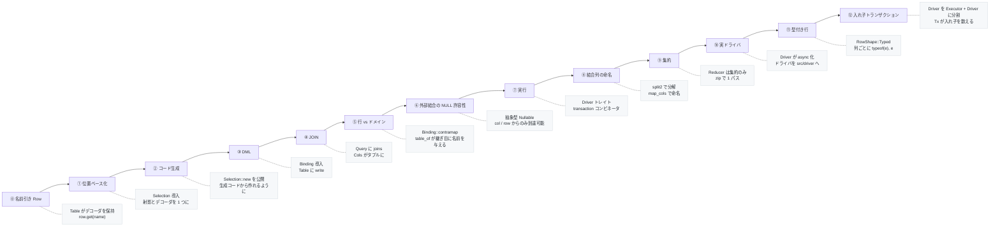

# 9. 設計ノート

[← スキーマ](08-schema.md) · [README](../../README_ja.md)

なぜ型がこの形なのか、何を意図的に置いていないのか、そして単にまだ作っていないのは
何か。

## 型の変遷

| 段階 | 変更 | 理由 |
|---|---|---|
| ⓪ | `Table { cols, decoder }`、`Row` は列名から値へのマップ | 最初のスケッチ |
| ① | `Row = ArrayView[SqlValue]`、`Selection[Out]` が射影とデコーダを持ち、`Table { .., all }` | 射影順とデコード順が食い違えなくなる |
| ② | `Selection::new` を公開 | 生成コードは別パッケージにあり、そこから作る必要がある |
| ③ | `Binding[In]` 追加、`Table { .., write }` | INSERT には値から行への向きが要る |
| ④ | `Query { .., joins }`、`Query::join` が `Cols` をタプルに | テーブルが 2 つ以上になる |
| ⑤ | `Binding::contramap` 追加、ジェネレータが `table_of` を出力、属性が `#cairn.table` に | 行型とドメイン型は別物であり、対応づけは手で書く |
| ⑥ | `left_join` が抽象型 `Nullable[C, R]` を返し、`Selection::optional` 追加 | 外部結合の NULL 許容性を型に守らせる |
| ⑦ | `Driver` トレイトと `transaction`、各文に `run` / `one` / `first` | SQL を組み立てるだけでなく実行する |
| ⑧ | `split2` と `Query::map_cols` 追加 | MoonBit にないラムダ引数の分解を肩代わりする |
| ⑨ | `Reducer[Out]` と `Query::reduce` / `group_by` | 不正な集約クエリを書けなくする |
| ⑩ | `Driver` と `run` / `one` / `first` / `transaction` が `async` 化、ドライバを `src/driver` へ | MoonBit の PostgreSQL クライアントが非同期で、同期トレイトでは保持できない |
| ⑪ | `Driver` に `RowShape`、`query` に `columns~` | SQLite バインディングは結果列の型も NULL 性も報告せず、当て推量は黙った誤答になる |
| ⑫ | `Driver` を `Executor` + `Driver : Executor` に分割、`Tx[D]` 追加、`transaction` が `Tx` を取る | それぞれ自分の仕事を括る 2 つの Repository が `BEGIN` を 2 回送ってはならず、トランザクション本体にコミットする権限はない |

## 繰り返し現れる 3 つの手

API のほとんどはこのどれかに従っています。

**対象とその読み方を対にする。** `Selection` は「どの列か」と「どうデコードするか」を
束ね、`Binding` は出ていく側で同じことをし、`Reducer` は集約についてそうします。
離しておくと 2 つの半身はずれます — 射影に列を足してデコーダを直し忘れる、というやつ
です。ジェネレータは同じフィールド列を 1 回走査して両方を吐くので、実際にはずれません。

**不正な状態を表現不能にするか、さもなくば声を上げさせる。** `Reducer` を抽象に
しているので、集約の隣に裸の列を射影できません。`Nullable` は表現を公開していないので、
外部結合が持ち込む NULL 許容性を失えません。型が言えないところ — 追跡番号のない
出荷済み注文、ドメイン型に対応する状態のない保存済み行 — では、対応づけが代わりに
`raise` します。

**危険な引数は必須にする。** `update` と `delete` が述語をチェーンの一段ではなく
位置引数として取るのは、一段は書き忘れられるうえ、書き忘れればテーブルを書き換えて
しまうからです。`update_all` と `delete_all` があるのは、絞り込みなしの場合が
呼び出し側で名前として見えるようにするためです。

## 安全側に倒している点

| 状況 | 挙動 |
|---|---|
| 行 0 件の INSERT | `EmptyInsert` を送出 |
| 代入のない UPDATE | `EmptyUpdate` を送出 |
| 列数と値数の不一致 | `ArityMismatch` を送出 |
| エイリアスが重複する結合（自己結合） | `DuplicateAlias` を送出 |
| 述語のない UPDATE / DELETE | `update_all` / `delete_all` を呼ぶ必要がある |
| `one` が 0 件または複数件を得た | `NotFound` / `TooManyRows` を送出 |
| トランザクション本体が失敗 | ROLLBACK し、同じエラーを再送出 |
| 入れ子のトランザクションが失敗し、外側が続行 | ROLLBACK し、元の原因を持つ `RollbackOnly` |
| 列が保持していない型として読まれた | `TypeMismatch` を送出 |
| ドライバなら `0` を返してしまう NULL | `RowShape::Typed` がデータベースに型を聞く |

## 未実装

- **エイリアスと自己結合** — `Cols` の中の `Column` がエイリアスを焼き込んでいるので、
  `Table` は `cols` を `(String) -> Cols` として持つ必要がある
- **セキュリティ型引数** — `Table[Sec, Cols, R]`。Acadia の `Table Unrestricted Food`
  に相当。`#cairn.table(security=...)` の枠は予約済み
- **PostgreSQL の DDL 出力** — 型対応表はあるが `generate` は SQLite 向け。
  `ALTER TABLE` が素直な分、SQLite より書く量は少ない
- **マイグレーションの適用** — `.sql` を `Executor` で流す `migrate` サブコマンドがない
- **複合主キーと複数列のユニーク制約** — `#cairn.id` は 1 列だけを指す
- **サブクエリと CTE** — `RawExpr` にネストした SELECT のコンストラクタがない
- **`RETURNING`** — DML は行数しか返さない

## 例題について

`src/example` は意図的にエンティティ 2 つだけに絞っています。

| | 示すもの |
|---|---|
| `entities.mbt` — `User` | 素直な場合。生成されたテーブルをそのまま使う |
| `orders.mbt` — `OrderRow` / `Order` | 継ぎ目。行型とドメインの直和型を `table_of` で対応づける |

それ以外の示す価値のあるものは、ここで重複させるのではなく実装されている場所で
固定してあります。結合・`Nullable`・`map_cols`・`split2` は
`src/sql/join_test.mbt`、集約は `src/sql/reducer_test.mbt`、入れ子トランザクションは
`src/driver/fake/fake_test.mbt` と、実データベースに対しては
`src/driver/sqlite/sqlite_test.mbt` です。

## ジェネレータについて

ジェネレータは
[`moonbitlang/parser`](https://mooncakes.io/docs/moonbitlang/parser)
で MoonBit ソースをパースします。属性は `Attribute.raw` の生テキストから読みます。
ユーザ定義名前空間では `parsed` が埋まらず、`name()` は名前空間を落としてしまう
（`#cairn.id` も `#morm.id` も `"id"` と報告する）からです。

文字列を受け取って文字列を返す設計にしてあり、ファイル IO は CLI 側に残しています。
そのおかげでパース・降下・出力のパイプライン全体をファイルシステムに触れずに
テストできます。

---

[← スキーマ](08-schema.md) · [README](../../README_ja.md)
